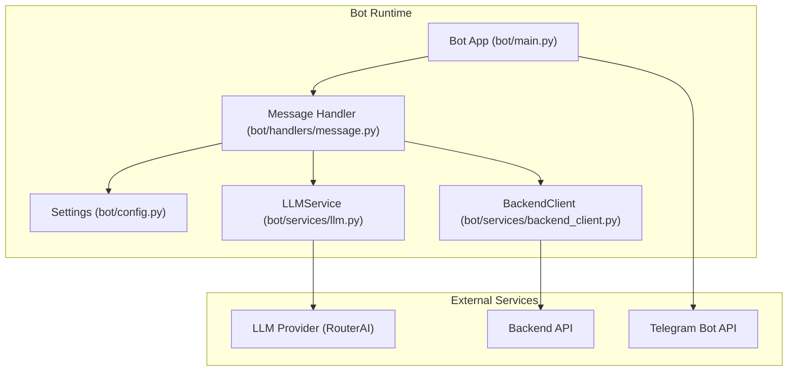
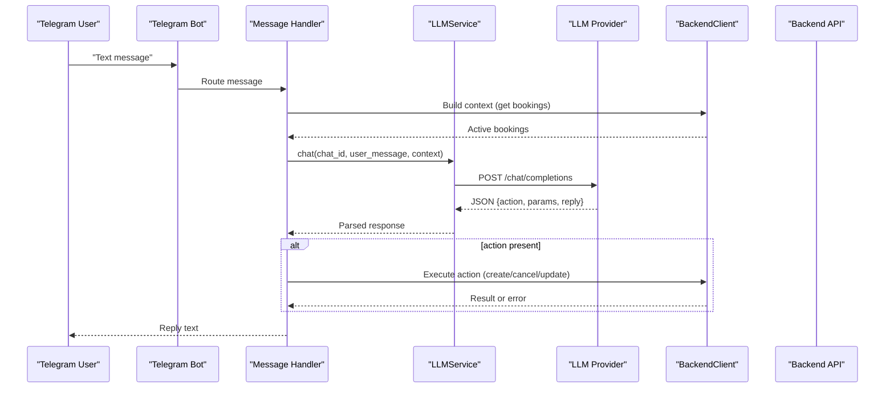
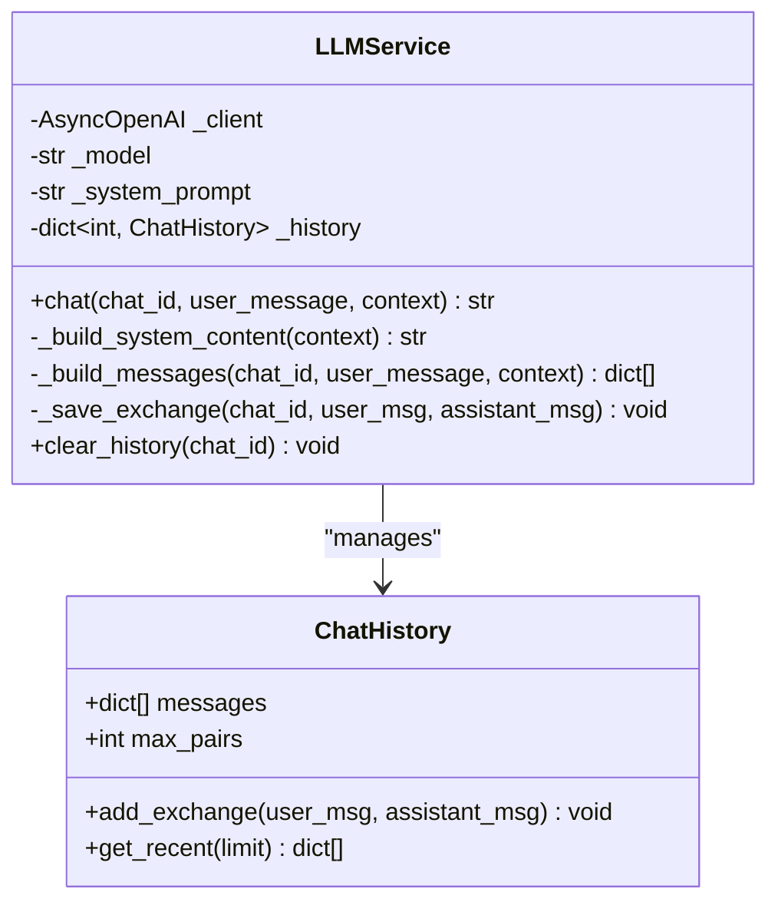
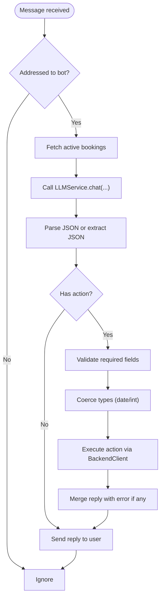
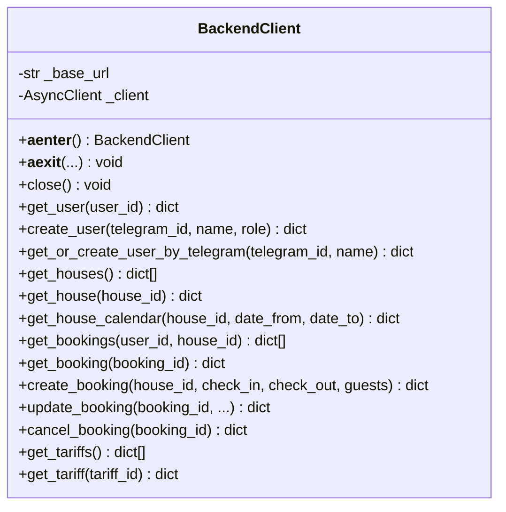
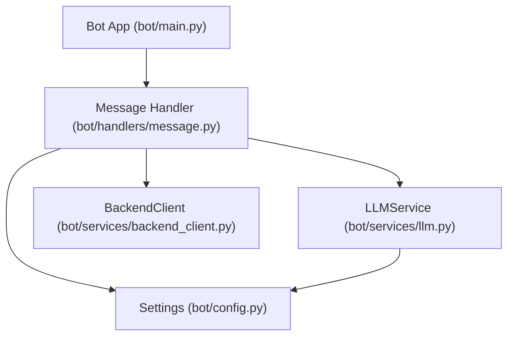

# LLM Integration and Natural Language Processing

<cite>
**Referenced Files in This Document**
- [bot/services/llm.py](file://bot/services/llm.py)
- [bot/handlers/message.py](file://bot/handlers/message.py)
- [bot/main.py](file://bot/main.py)
- [bot/config.py](file://bot/config.py)
- [bot/services/backend_client.py](file://bot/services/backend_client.py)
- [docs/integrations.md](file://docs/integrations.md)
- [README.md](file://README.md)
</cite>

## Table of Contents
1. [Introduction](#introduction)
2. [Project Structure](#project-structure)
3. [Core Components](#core-components)
4. [Architecture Overview](#architecture-overview)
5. [Detailed Component Analysis](#detailed-component-analysis)
6. [Dependency Analysis](#dependency-analysis)
7. [Performance Considerations](#performance-considerations)
8. [Troubleshooting Guide](#troubleshooting-guide)
9. [Conclusion](#conclusion)
10. [Appendices](#appendices)

## Introduction
This document explains the LLM integration and natural language processing pipeline powering the Telegram bot. It covers how natural language inputs are transformed into structured booking actions, how the system integrates with an OpenAI-compatible LLM provider, and how responses are processed and executed against the backend API. It also documents configuration, error handling, fallback strategies, and practical guidance for prompt engineering and performance optimization.

## Project Structure
The LLM integration lives primarily in the bot package:
- Configuration and environment variables define credentials, model, and system prompts.
- The LLM service encapsulates OpenAI-compatible API calls, manages conversation history, and applies rate-limit and error fallbacks.
- The message handler orchestrates user input, builds contextual LLM prompts, parses JSON responses, and dispatches actions to the backend.

**Diagram sources**
- [bot/main.py:15-41](file://bot/main.py#L15-L41)
- [bot/handlers/message.py:387-436](file://bot/handlers/message.py#L387-L436)
- [bot/services/llm.py:43-106](file://bot/services/llm.py#L43-L106)
- [bot/services/backend_client.py:26-244](file://bot/services/backend_client.py#L26-L244)
- [bot/config.py:44-67](file://bot/config.py#L44-L67)

**Section sources**
- [README.md:11-21](file://README.md#L11-L21)
- [docs/integrations.md:5-21](file://docs/integrations.md#L5-L21)
- [bot/main.py:15-41](file://bot/main.py#L15-L41)

## Core Components
- LLMService: Manages OpenAI-compatible client, system prompt assembly, conversation history per chat, and robust error handling with fallback responses.
- Message Handler: Filters addressed messages, builds user context, calls LLM, parses JSON action replies, executes actions via BackendClient, and composes user-friendly replies.
- BackendClient: Provides typed async HTTP client with retries, timeouts, and explicit error classes for backend API interactions.
- Settings: Centralized configuration for Telegram token, LLM provider credentials, model, base URL, system prompt, and backend API URL.

Key responsibilities:
- Conversation intelligence: system prompt + recent history + current user message.
- Structured action extraction: strict JSON schema with action and params.
- Safety and resilience: rate limit handling, API errors, and fallback responses.

**Section sources**
- [bot/services/llm.py:43-106](file://bot/services/llm.py#L43-L106)
- [bot/handlers/message.py:66-89](file://bot/handlers/message.py#L66-L89)
- [bot/handlers/message.py:285-323](file://bot/handlers/message.py#L285-L323)
- [bot/services/backend_client.py:26-118](file://bot/services/backend_client.py#L26-L118)
- [bot/config.py:44-67](file://bot/config.py#L44-L67)

## Architecture Overview
The bot receives user messages, optionally filters them based on addressing rules, builds a system prompt enriched with today’s date and current bookings context, sends the prompt to the LLM provider, parses the JSON response, and executes the requested action against the backend API. Responses are sent back to the user.

**Diagram sources**
- [bot/handlers/message.py:387-436](file://bot/handlers/message.py#L387-L436)
- [bot/services/llm.py:80-101](file://bot/services/llm.py#L80-L101)
- [bot/services/backend_client.py:199-231](file://bot/services/backend_client.py#L199-L231)

## Detailed Component Analysis

### LLMService: OpenAI-Compatible Client and Conversation Intelligence
- Initialization: Creates an async OpenAI client using provider base URL and API key from settings, sets model and system prompt.
- System prompt assembly: Injects today’s date and optional current bookings context into the system prompt.
- Message building: Composes a message array with system content, recent history, and the new user message.
- History management: Maintains per-chat history with bounded length and pair-based limits.
- Execution: Calls the provider’s completions endpoint and returns either the model’s content or a fallback response.
- Error handling: Special handling for rate limits and generic API errors; logs unexpected exceptions and returns a friendly fallback.

**Diagram sources**
- [bot/services/llm.py:21-41](file://bot/services/llm.py#L21-L41)
- [bot/services/llm.py:43-106](file://bot/services/llm.py#L43-L106)

**Section sources**
- [bot/services/llm.py:43-106](file://bot/services/llm.py#L43-L106)

### Message Handler: Parsing, Validation, and Action Dispatch
- Addressing and filtering: Determines if the message is directed at the bot (private chat, mention, or reply).
- Context building: Fetches active bookings and formats them for inclusion in the system prompt.
- LLM invocation: Sends the assembled prompt to LLMService and parses the response.
- JSON parsing: Attempts strict JSON parse; if that fails, extracts a JSON object from the text; otherwise returns a safe fallback with action=null.
- Validation and coercion: Validates required fields and coerces types (dates, integers).
- Action dispatch: Executes create, cancel, or update actions against the backend; handles special cases where the reply should be canceled on booking errors.
- Reply composition: Merges LLM-generated reply with any action errors and sends to the user.

**Diagram sources**
- [bot/handlers/message.py:387-436](file://bot/handlers/message.py#L387-L436)
- [bot/handlers/message.py:66-89](file://bot/handlers/message.py#L66-L89)
- [bot/handlers/message.py:104-129](file://bot/handlers/message.py#L104-L129)
- [bot/handlers/message.py:285-323](file://bot/handlers/message.py#L285-L323)

**Section sources**
- [bot/handlers/message.py:387-436](file://bot/handlers/message.py#L387-L436)
- [bot/handlers/message.py:66-89](file://bot/handlers/message.py#L66-L89)
- [bot/handlers/message.py:104-129](file://bot/handlers/message.py#L104-L129)
- [bot/handlers/message.py:285-323](file://bot/handlers/message.py#L285-L323)

### BackendClient: Robust HTTP Integration
- Async client lifecycle: Lazy initialization with configurable timeout and redirect following.
- Retry and error handling: Retries transient server errors and timeouts; raises typed exceptions with status codes for different HTTP outcomes.
- Typed endpoints: Methods for users, houses, bookings, and tariffs with automatic ISO conversion for dates.
- Context manager support: Ensures proper client lifecycle management.

**Diagram sources**
- [bot/services/backend_client.py:26-244](file://bot/services/backend_client.py#L26-L244)

**Section sources**
- [bot/services/backend_client.py:26-118](file://bot/services/backend_client.py#L26-L118)
- [bot/services/backend_client.py:199-231](file://bot/services/backend_client.py#L199-L231)

### Configuration and Environment Management
- Settings class loads environment variables from a .env file and exposes:
  - Telegram bot token and username
  - LLM provider credentials (API key, base URL)
  - Model identifier and system prompt template
  - Backend API URL
  - Optional proxy configuration
- The system prompt template includes:
  - Role and personality
  - Available houses and capacity constraints
  - Strict JSON response format
  - Supported actions and rules (date parsing, context usage)
  - Current date insertion

**Section sources**
- [bot/config.py:44-67](file://bot/config.py#L44-L67)
- [bot/config.py:7-41](file://bot/config.py#L7-L41)

## Dependency Analysis
- The bot runtime wires Settings, BackendClient, and LLMService into the dispatcher.
- The message handler depends on Settings for addressing and configuration, BackendClient for backend operations, and LLMService for NLP.
- LLMService depends on the OpenAI SDK and Settings for provider configuration.
- External dependencies include the LLM provider (OpenAI-compatible) and the backend API.

**Diagram sources**
- [bot/main.py:34-36](file://bot/main.py#L34-L36)
- [bot/handlers/message.py:387-436](file://bot/handlers/message.py#L387-L436)
- [bot/services/llm.py:46-53](file://bot/services/llm.py#L46-L53)
- [bot/config.py:44-67](file://bot/config.py#L44-L67)

**Section sources**
- [bot/main.py:34-36](file://bot/main.py#L34-L36)
- [bot/handlers/message.py:387-436](file://bot/handlers/message.py#L387-L436)
- [bot/services/llm.py:46-53](file://bot/services/llm.py#L46-L53)

## Performance Considerations
- Conversation history bounds: Limit number of recent exchanges and message pairs to control context size and reduce latency.
- Provider selection: Choose a model appropriate for the workload; monitor token throughput and latency.
- Caching: Cache repeated context segments (e.g., house lists, tariffs) to reduce redundant backend calls.
- Timeout tuning: Adjust client timeouts to balance responsiveness and reliability.
- Retry strategy: Use exponential backoff for transient failures; avoid thundering herds by staggering retries.
- Streaming: If the provider supports streaming, consider incremental rendering to improve perceived latency.
- Monitoring: Log provider latency, error rates, and token usage; alert on sustained degradation.

[No sources needed since this section provides general guidance]

## Troubleshooting Guide
Common issues and mitigations:
- Rate limit errors: The LLM service returns a friendly message and logs a warning; consider adding jittered backoff and circuit breaker logic.
- API errors: Generic API errors trigger a fallback response; ensure logs capture provider error messages for diagnosis.
- Unexpected exceptions: Unhandled exceptions are logged and mapped to a fallback response; add targeted exception handlers for provider-specific errors.
- JSON parsing failures: If the model does not return strict JSON, the handler attempts to extract a JSON block; ensure the system prompt clearly instructs the model to return JSON only.
- Backend connectivity: BackendClient raises typed exceptions for various HTTP outcomes; surface actionable messages to the user and avoid exposing internal errors.
- Addressing ambiguity: In group chats, ensure the bot responds only when explicitly addressed (mention or reply) to avoid noise.

**Section sources**
- [bot/services/llm.py:90-98](file://bot/services/llm.py#L90-L98)
- [bot/handlers/message.py:66-89](file://bot/handlers/message.py#L66-L89)
- [bot/services/backend_client.py:67-111](file://bot/services/backend_client.py#L67-L111)

## Conclusion
The LLM integration centers on a clean separation of concerns: the message handler focuses on user-facing orchestration, the LLM service encapsulates provider communication and conversation memory, and the backend client abstracts API interactions. By enforcing strict JSON responses, bounding conversation context, and implementing robust error handling, the system remains resilient and maintainable. Extending the system involves refining prompts, adding more actions, and introducing caching and monitoring.

[No sources needed since this section summarizes without analyzing specific files]

## Appendices

### Prompt Engineering Best Practices
- Be explicit about output format: Require a strict JSON envelope with action, params, and reply.
- Provide clear examples of intent and structure.
- Define domain-specific constraints (e.g., house names, capacity, date parsing rules).
- Keep system prompt concise but comprehensive; inject dynamic context (current date, active bookings) to guide grounded decisions.
- Iterate on few-shot examples and guardrails to reduce hallucinations.

[No sources needed since this section provides general guidance]

### Integration Patterns and API Communication
- Provider compatibility: The LLM service uses an OpenAI-compatible client; ensure the provider supports the chat completions endpoint and JSON-only output.
- Authentication: Store API keys in environment variables; avoid hardcoding secrets.
- Base URL customization: Allow swapping providers by changing the base URL and model identifiers.
- Health checks: Add periodic health checks to the LLM provider endpoint to detect outages proactively.

**Section sources**
- [docs/integrations.md:41-47](file://docs/integrations.md#L41-L47)
- [bot/config.py:51-53](file://bot/config.py#L51-L53)

### Example Workflows: From Natural Language to Structured Requests
- User asks to book a house for a specific weekend with a number of guests.
- The handler builds context from active bookings, constructs the system prompt with today’s date, and sends the message to the LLM.
- The LLM returns a JSON payload indicating the action (create_booking) and parameters (house, check-in/out, guests).
- The handler validates and coerces types, finds the house by name, and calls the backend to create the booking.
- The handler composes a reply combining the LLM’s message with any action outcome and sends it to the user.

**Section sources**
- [bot/handlers/message.py:387-436](file://bot/handlers/message.py#L387-L436)
- [bot/services/llm.py:80-101](file://bot/services/llm.py#L80-L101)
- [bot/services/backend_client.py:199-231](file://bot/services/backend_client.py#L199-L231)