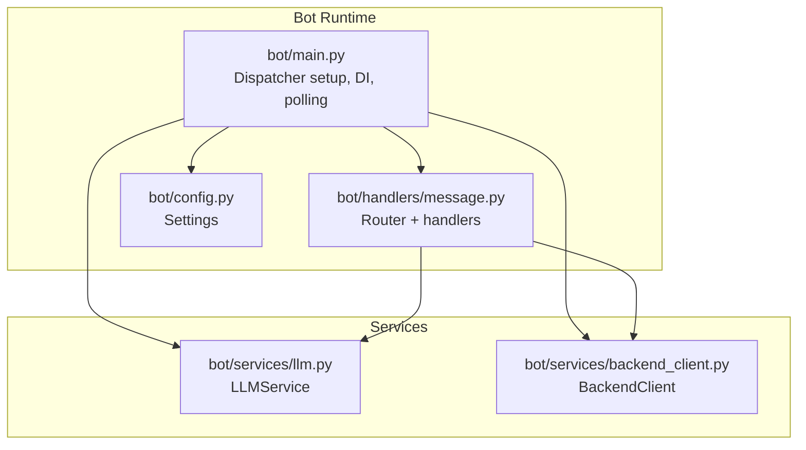
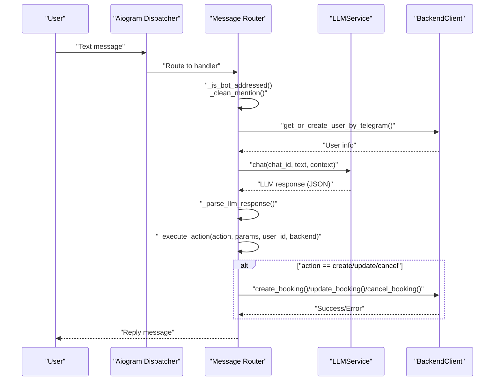
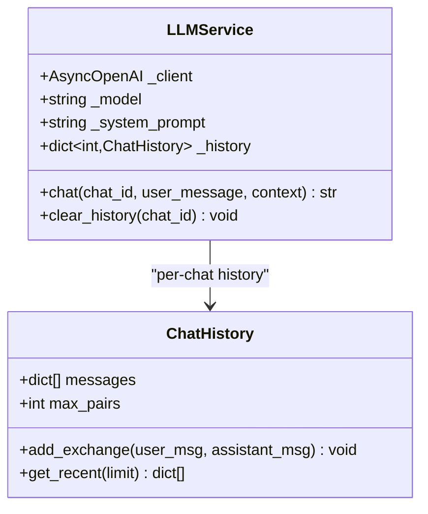
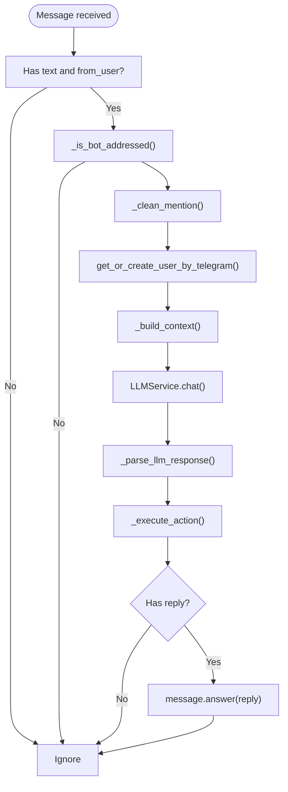
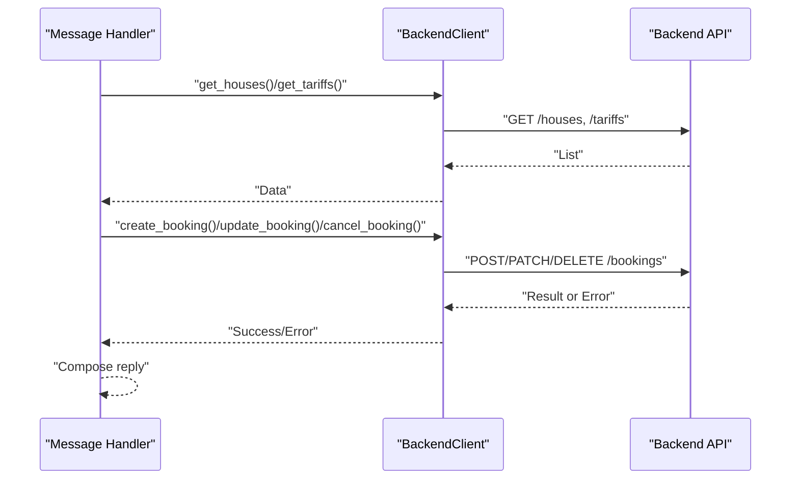
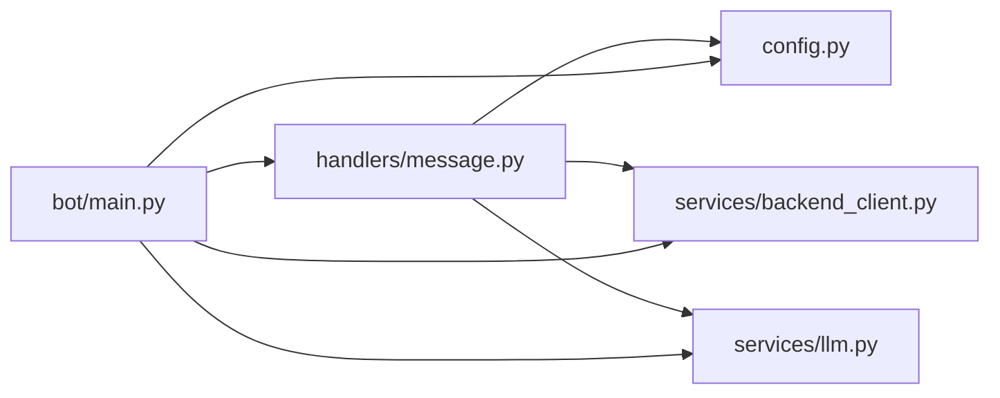

# Message Handling and Processing

<cite>
**Referenced Files in This Document**
- [bot/main.py](file://bot/main.py)
- [bot/handlers/message.py](file://bot/handlers/message.py)
- [bot/services/llm.py](file://bot/services/llm.py)
- [bot/services/backend_client.py](file://bot/services/backend_client.py)
- [bot/config.py](file://bot/config.py)
- [bot/tests/test_message_handler.py](file://bot/tests/test_message_handler.py)
- [README.md](file://README.md)
</cite>

## Table of Contents
1. [Introduction](#introduction)
2. [Project Structure](#project-structure)
3. [Core Components](#core-components)
4. [Architecture Overview](#architecture-overview)
5. [Detailed Component Analysis](#detailed-component-analysis)
6. [Dependency Analysis](#dependency-analysis)
7. [Performance Considerations](#performance-considerations)
8. [Troubleshooting Guide](#troubleshooting-guide)
9. [Conclusion](#conclusion)

## Introduction
This document explains how the Telegram bot processes user messages, routes them to appropriate handlers, recognizes intents, manages conversation state, and generates responses. It covers both beginner-friendly concepts (how users talk to the bot and what happens next) and technical details for developers implementing custom handlers or extending the system using the Aiogram framework.

The bot’s conversation flow follows a clear pipeline:
- Entry point initializes the Aiogram Dispatcher and registers the message router.
- Incoming messages are filtered and validated (addressing, text presence, user identity).
- The system builds a user context and sends the message to an LLM service configured via OpenAI-compatible API.
- The LLM responds with a structured JSON containing an action, parameters, and a human-readable reply.
- The dispatcher executes the requested action against the backend API and composes the final reply.
- The bot replies to the user with the generated message.

## Project Structure
The bot module is organized around three pillars:
- Entry point and DI container: initializes logging, settings, session, and registers routers.
- Handlers: message router with filters, commands, and the main message processor.
- Services: LLM service for conversational AI and backend client for API interactions.

**Diagram sources**
- [bot/main.py:15-41](file://bot/main.py#L15-L41)
- [bot/handlers/message.py:18-393](file://bot/handlers/message.py#L18-L393)
- [bot/services/llm.py:43-101](file://bot/services/llm.py#L43-L101)
- [bot/services/backend_client.py:26-243](file://bot/services/backend_client.py#L26-L243)
- [bot/config.py:44-66](file://bot/config.py#L44-L66)

**Section sources**
- [bot/main.py:15-41](file://bot/main.py#L15-L41)
- [README.md:13-20](file://README.md#L13-L20)

## Core Components
- Dispatcher and DI container: registers the message router and exposes shared dependencies (settings, backend client, LLM service) to handlers.
- Message router: defines filters and handlers for commands and general messages.
- LLM service: maintains per-chat history, constructs system prompts, and calls the OpenAI-compatible API.
- Backend client: wraps HTTP calls to the backend API with retries, timeouts, and error normalization.

Key responsibilities:
- Message filtering and pre-processing (addressing checks, mentions, cleaning).
- Intent parsing via LLM JSON schema.
- Action dispatching to backend operations.
- Reply composition and error handling.

**Section sources**
- [bot/main.py:32-38](file://bot/main.py#L32-L38)
- [bot/handlers/message.py:387-435](file://bot/handlers/message.py#L387-L435)
- [bot/services/llm.py:43-101](file://bot/services/llm.py#L43-L101)
- [bot/services/backend_client.py:26-118](file://bot/services/backend_client.py#L26-L118)

## Architecture Overview
The message handling pipeline integrates Aiogram’s Dispatcher with two external services: the LLM provider and the backend API. The diagram below maps the actual code paths.

**Diagram sources**
- [bot/handlers/message.py:387-435](file://bot/handlers/message.py#L387-L435)
- [bot/services/llm.py:80-101](file://bot/services/llm.py#L80-L101)
- [bot/services/backend_client.py:137-230](file://bot/services/backend_client.py#L137-L230)

## Detailed Component Analysis

### Message Router and Filters
- Router registration: the main entry point includes the message router into the Dispatcher so handlers are invoked on incoming updates.
- Addressing logic: messages are accepted only when addressed to the bot (private chat, reply to bot, or mention).
- Text cleaning: removes the bot’s mention from the message text before processing.

Practical examples:
- Private chat: any text message is processed.
- Group chat: only messages that reply to the bot or contain a mention are considered addressed.
- Mention removal: ensures downstream intent parsing ignores the "@bot" prefix.

**Section sources**
- [bot/main.py:38](file://bot/main.py#L38)
- [bot/handlers/message.py:26-58](file://bot/handlers/message.py#L26-L58)
- [bot/handlers/message.py:387-403](file://bot/handlers/message.py#L387-L403)

### Intent Recognition and JSON Parsing
- LLM response format: the system expects a strict JSON with keys: action, params, reply.
- Fallback parsing: if raw JSON is not detected, the system falls back to treating the entire text as a reply.
- Validation: the parser enforces the presence of the reply field and extracts structured data.

Common message types:
- Natural language booking requests (“Book the old house for the upcoming weekend, 6 people”).
- Requests for help or bookings list (/help, /bookings).
- Group chat interactions via mention or reply.

**Section sources**
- [bot/handlers/message.py:66-89](file://bot/handlers/message.py#L66-L89)
- [bot/services/llm.py:55-60](file://bot/services/llm.py#L55-L60)

### Conversation State Management
- Per-chat history: the LLM service maintains a bounded history per chat_id, limiting stored exchanges to keep prompt sizes manageable.
- Context building: the message handler fetches active bookings and passes them to the LLM as contextual information.
- History limits: enforced by ChatHistory with max_pairs and recent slices.

**Diagram sources**
- [bot/services/llm.py:21-41](file://bot/services/llm.py#L21-L41)
- [bot/services/llm.py:43-101](file://bot/services/llm.py#L43-L101)

**Section sources**
- [bot/services/llm.py:21-41](file://bot/services/llm.py#L21-L41)
- [bot/handlers/message.py:147-157](file://bot/handlers/message.py#L147-L157)

### Handler Functions and Processing Pipeline
- Commands: /start, /help, /bookings are handled by dedicated handlers.
- General message handler: validates addressing, resolves user, builds context, queries LLM, parses JSON, executes actions, and replies.

**Diagram sources**
- [bot/handlers/message.py:387-435](file://bot/handlers/message.py#L387-L435)
- [bot/services/llm.py:80-101](file://bot/services/llm.py#L80-L101)
- [bot/services/backend_client.py:137-151](file://bot/services/backend_client.py#L137-L151)

**Section sources**
- [bot/handlers/message.py:330-384](file://bot/handlers/message.py#L330-L384)
- [bot/handlers/message.py:387-435](file://bot/handlers/message.py#L387-L435)

### Action Dispatch and Backend Integration
- Supported actions: create_booking, cancel_booking, update_booking.
- Validation and type coercion: converts dates and integers from strings, raises ActionError for missing fields.
- Execution: calls backend APIs and handles errors, returning either a user-facing message or requesting cancellation of the LLM-generated reply.

**Diagram sources**
- [bot/handlers/message.py:185-282](file://bot/handlers/message.py#L185-L282)
- [bot/services/backend_client.py:157-230](file://bot/services/backend_client.py#L157-L230)

**Section sources**
- [bot/handlers/message.py:285-323](file://bot/handlers/message.py#L285-L323)
- [bot/handlers/message.py:185-282](file://bot/handlers/message.py#L185-L282)
- [bot/services/backend_client.py:157-230](file://bot/services/backend_client.py#L157-L230)

### Response Generation Logic
- Reply composition: combines LLM-provided reply with backend action errors.
- Error semantics: certain booking errors trigger “cancel LLM reply” to avoid redundant or conflicting messages.
- Fallbacks: LLM service returns structured fallbacks on rate limits or API errors.

**Section sources**
- [bot/handlers/message.py:422-435](file://bot/handlers/message.py#L422-L435)
- [bot/services/llm.py:15-18](file://bot/services/llm.py#L15-L18)
- [bot/services/llm.py:90-98](file://bot/services/llm.py#L90-L98)

### Handler Registration and Middleware Integration
- Registration: the message router is included into the Dispatcher in the main entry point.
- Middleware/DI: settings, backend client, and LLM service are attached to the Dispatcher and injected into handlers via dependency injection.
- Filters: Aiogram filters (Command) are used for command handlers; custom filters are implemented for addressing logic.

**Section sources**
- [bot/main.py:32-38](file://bot/main.py#L32-L38)
- [bot/handlers/message.py:330-384](file://bot/handlers/message.py#L330-L384)

### Error Handling Strategies
- Backend API errors: normalized into BackendAPIError with status codes and messages; handlers catch and present user-friendly replies.
- LLM errors: rate limits and API errors are handled with fallback responses; unexpected errors are logged and mitigated.
- Action-level errors: BookingActionError signals that the LLM reply should be canceled; ActionError indicates validation failures.

**Section sources**
- [bot/services/backend_client.py:17-24](file://bot/services/backend_client.py#L17-L24)
- [bot/services/backend_client.py:61-112](file://bot/services/backend_client.py#L61-L112)
- [bot/services/llm.py:90-98](file://bot/services/llm.py#L90-L98)
- [bot/handlers/message.py:96-102](file://bot/handlers/message.py#L96-L102)
- [bot/handlers/message.py:314-322](file://bot/handlers/message.py#L314-L322)

## Dependency Analysis
The message handler depends on:
- Router for Aiogram routing.
- Settings for bot username and system prompt.
- BackendClient for user resolution and booking operations.
- LLMService for natural language understanding and structured responses.

**Diagram sources**
- [bot/handlers/message.py:13-15](file://bot/handlers/message.py#L13-L15)
- [bot/main.py:32-38](file://bot/main.py#L32-L38)

**Section sources**
- [bot/handlers/message.py:13-15](file://bot/handlers/message.py#L13-L15)
- [bot/main.py:32-38](file://bot/main.py#L32-L38)

## Performance Considerations
- Concurrency: Aiogram runs handlers concurrently; ensure backend and LLM calls are awaited to prevent blocking.
- LLM history limits: ChatHistory caps stored exchanges to reduce latency and cost.
- Retry and timeouts: BackendClient applies retry logic and timeouts to API calls.
- Context size: Limit active booking context length to keep prompts concise.
- Logging: Configure log level appropriately to balance observability and overhead.

[No sources needed since this section provides general guidance]

## Troubleshooting Guide
Common issues and resolutions:
- Messages ignored in group chats:
  - Ensure the message replies to the bot or includes a mention.
  - Verify bot username in settings matches the actual bot username.
- LLM replies not parsed:
  - Confirm the LLM response adheres to the expected JSON schema with action, params, and reply.
  - Check system prompt and context formatting.
- Booking action errors:
  - Missing required fields cause ActionError; ensure house name, dates, and guest count are provided.
  - Backend errors surface as user-friendly messages; inspect logs for details.
- Rate limits or API errors:
  - LLMService returns fallback responses on rate limits or API errors; retry later or adjust quotas.
- Tests for action execution:
  - Use unit tests to validate error semantics and success paths for action dispatch.

**Section sources**
- [bot/handlers/message.py:26-58](file://bot/handlers/message.py#L26-L58)
- [bot/handlers/message.py:66-89](file://bot/handlers/message.py#L66-L89)
- [bot/handlers/message.py:96-102](file://bot/handlers/message.py#L96-L102)
- [bot/handlers/message.py:314-322](file://bot/handlers/message.py#L314-L322)
- [bot/services/llm.py:90-98](file://bot/services/llm.py#L90-L98)
- [bot/tests/test_message_handler.py:15-83](file://bot/tests/test_message_handler.py#L15-L83)
- [bot/tests/test_message_handler.py:85-177](file://bot/tests/test_message_handler.py#L85-L177)

## Conclusion
The bot’s message handling pipeline leverages Aiogram’s routing and dependency injection, combined with an LLM for intent recognition and a backend client for stateful operations. By structuring LLM responses as JSON with explicit actions, the system cleanly separates natural language understanding from domain operations. Developers can extend the system by adding new actions, refining the system prompt, and integrating additional services while preserving the existing handler registration and error-handling patterns.