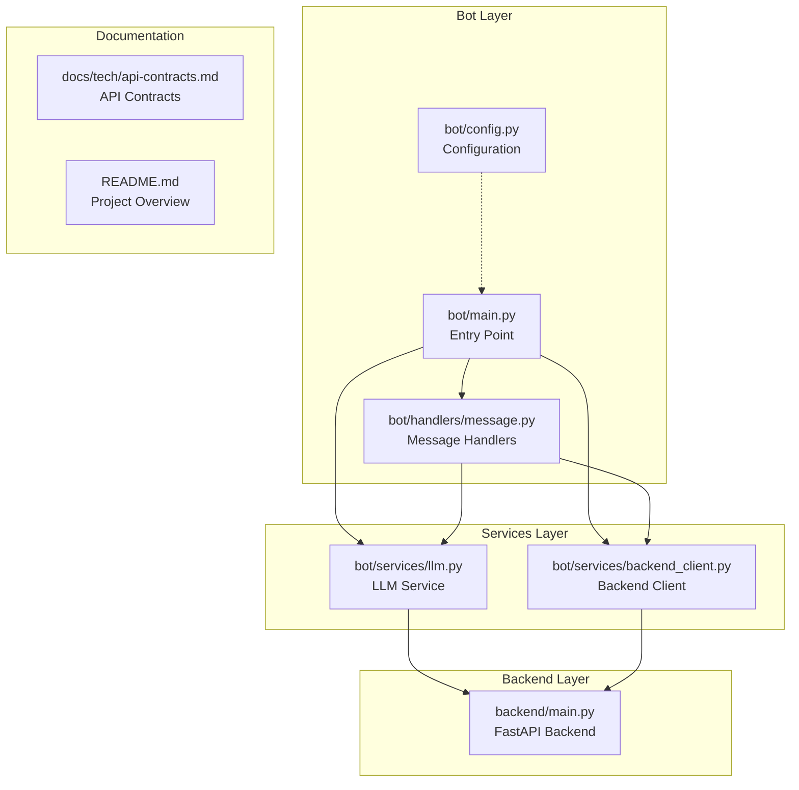
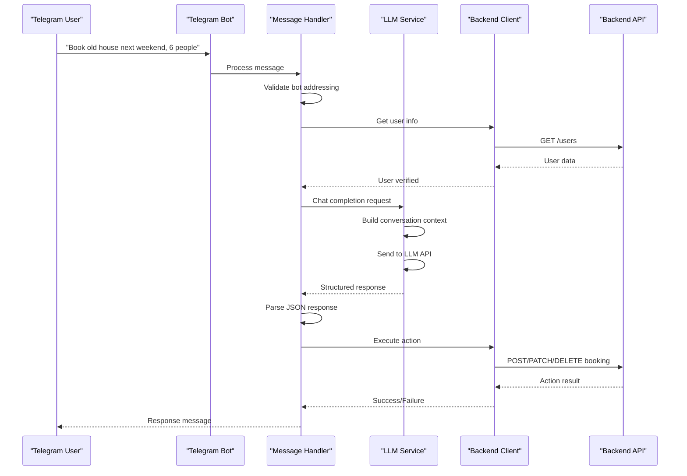
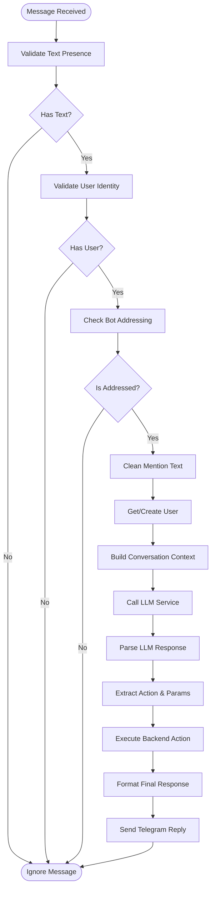
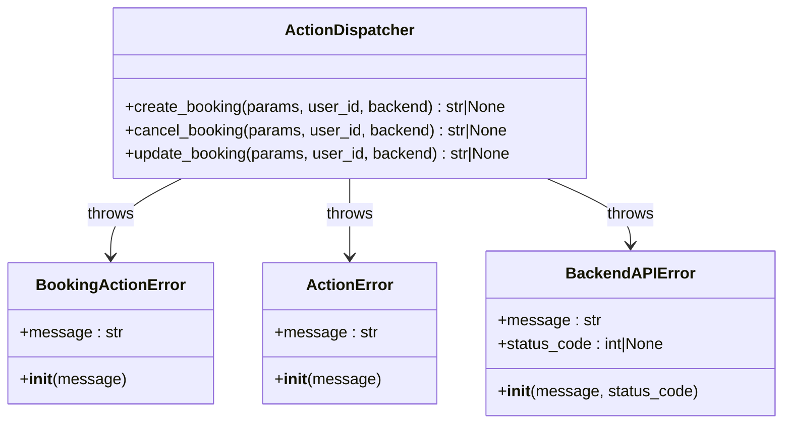
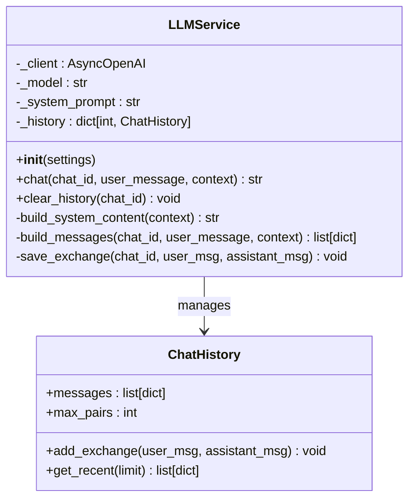
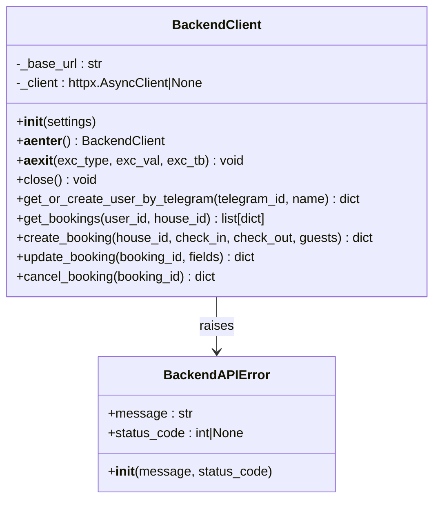
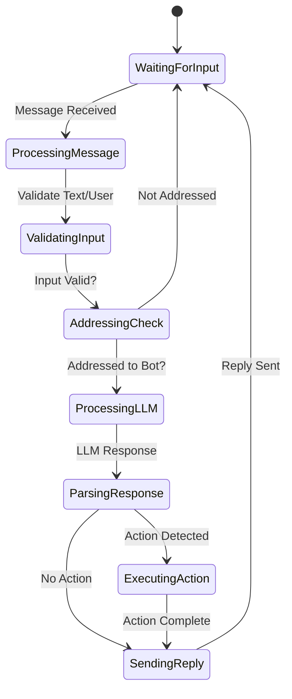
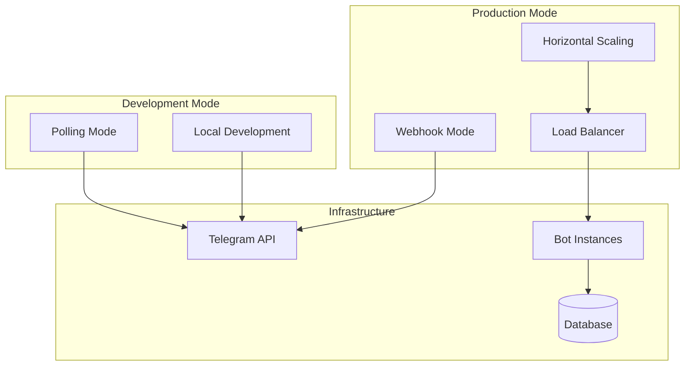
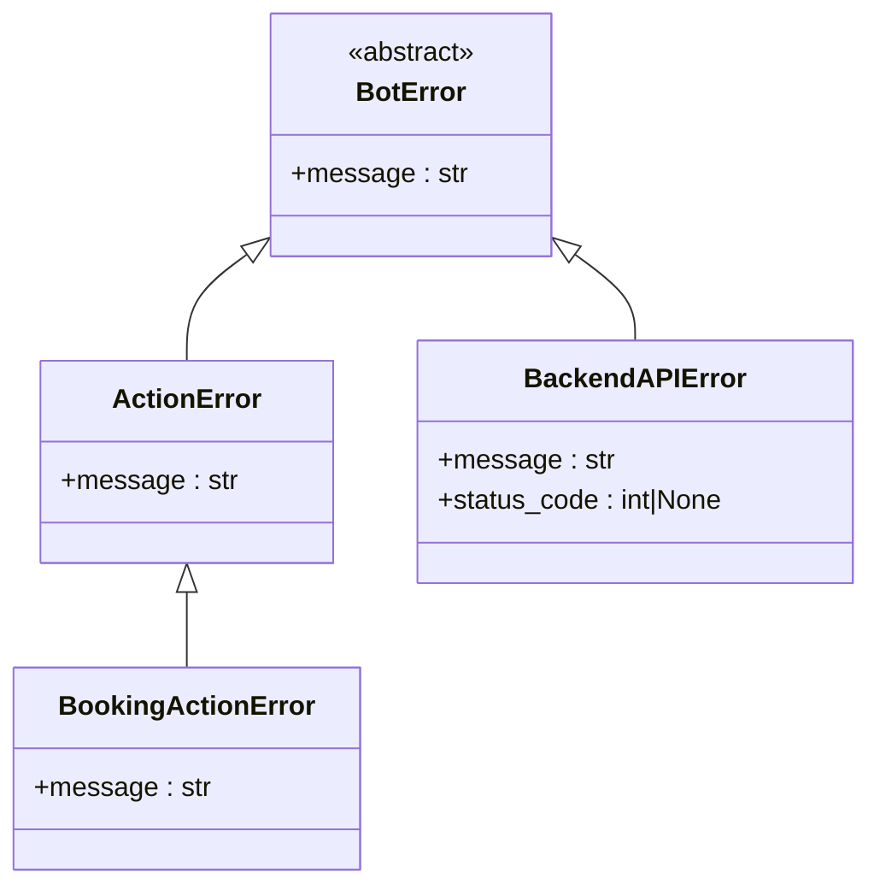

# Telegram Bot Implementation

<cite>
**Referenced Files in This Document**
- [bot/main.py](file://bot/main.py)
- [bot/config.py](file://bot/config.py)
- [bot/handlers/message.py](file://bot/handlers/message.py)
- [bot/services/llm.py](file://bot/services/llm.py)
- [bot/services/backend_client.py](file://bot/services/backend_client.py)
- [backend/main.py](file://backend/main.py)
- [docs/tech/api-contracts.md](file://docs/tech/api-contracts.md)
- [README.md](file://README.md)
- [bot/tests/test_message_handler.py](file://bot/tests/test_message_handler.py)
</cite>

## Table of Contents
1. [Introduction](#introduction)
2. [Project Structure](#project-structure)
3. [Core Components](#core-components)
4. [Architecture Overview](#architecture-overview)
5. [Detailed Component Analysis](#detailed-component-analysis)
6. [Conversation Management](#conversation-management)
7. [Natural Language Processing](#natural-language-processing)
8. [Integration with LLM Services](#integration-with-llm-services)
9. [Configuration Options](#configuration-options)
10. [Webhook Handling](#webhook-handling)
11. [Error Management](#error-management)
12. [Performance Considerations](#performance-considerations)
13. [Troubleshooting Guide](#troubleshooting-guide)
14. [Conclusion](#conclusion)

## Introduction

The Telegram bot implementation provides a conversational booking interface that allows users to interact with the property rental system through natural language. Built with the Aiogram framework, this bot serves as the primary user interface for booking vacation homes, managing reservations, and handling customer inquiries.

The bot operates on a three-tier architecture: Telegram API layer, conversational processing layer, and backend service integration. It leverages Large Language Model (LLM) capabilities to understand user intents and translate natural language requests into structured booking actions.

## Project Structure

The bot implementation follows a modular structure organized by functional domains:



**Diagram sources**
- [bot/main.py:1-46](file://bot/main.py#L1-L46)
- [bot/config.py:1-67](file://bot/config.py#L1-L67)
- [bot/handlers/message.py:1-436](file://bot/handlers/message.py#L1-L436)
- [bot/services/llm.py:1-106](file://bot/services/llm.py#L1-L106)
- [bot/services/backend_client.py:1-244](file://bot/services/backend_client.py#L1-L244)
- [backend/main.py:1-173](file://backend/main.py#L1-L173)

**Section sources**
- [bot/main.py:1-46](file://bot/main.py#L1-L46)
- [bot/config.py:1-67](file://bot/config.py#L1-L67)
- [bot/handlers/message.py:1-436](file://bot/handlers/message.py#L1-L436)

## Core Components

### Bot Entry Point and Initialization

The bot initialization process establishes the core infrastructure including logging configuration, dependency injection, and service registration. The main entry point creates an Aiogram Bot instance with optional proxy support and initializes the Dispatcher with shared resources.

Key initialization steps include:
- Environment-based configuration loading through Pydantic settings
- Optional HTTP proxy configuration for outbound requests
- Dependency injection of backend client and LLM service instances
- Router inclusion for message processing

### Message Handler System

The message handler system implements a sophisticated filtering mechanism to determine when user messages should be processed. It supports three interaction modes:

1. **Private Chats**: Direct bot interactions without special addressing
2. **Group Mentions**: Messages containing @bot_username mentions
3. **Reply Actions**: Messages that reply to bot's previous messages

The handler performs comprehensive validation including text presence checks, user identification verification, and bot address validation before processing.

### LLM Integration Service

The LLM service provides conversational intelligence with built-in context management and conversation history tracking. It maintains separate conversation histories per chat ID and implements rate limiting and fallback mechanisms for robust operation.

### Backend Integration Client

The backend client handles all external API communications with comprehensive error handling, retry logic, and type-safe request/response processing. It supports lazy initialization, connection pooling, and graceful resource cleanup.

**Section sources**
- [bot/main.py:15-46](file://bot/main.py#L15-L46)
- [bot/handlers/message.py:26-58](file://bot/handlers/message.py#L26-L58)
- [bot/services/llm.py:43-106](file://bot/services/llm.py#L43-L106)
- [bot/services/backend_client.py:26-118](file://bot/services/backend_client.py#L26-L118)

## Architecture Overview

The bot architecture implements a layered approach with clear separation of concerns:



**Diagram sources**
- [bot/handlers/message.py:387-436](file://bot/handlers/message.py#L387-L436)
- [bot/services/llm.py:80-101](file://bot/services/llm.py#L80-L101)
- [bot/services/backend_client.py:199-230](file://bot/services/backend_client.py#L199-L230)

The architecture ensures loose coupling between components while maintaining efficient communication patterns. The LLM service acts as an intelligent intermediary, translating natural language into structured actions that the backend can execute reliably.

**Section sources**
- [bot/handlers/message.py:387-436](file://bot/handlers/message.py#L387-L436)
- [bot/services/llm.py:43-106](file://bot/services/llm.py#L43-L106)
- [bot/services/backend_client.py:26-118](file://bot/services/backend_client.py#L26-L118)

## Detailed Component Analysis

### Message Processing Pipeline

The message processing pipeline implements a comprehensive flow that validates input, manages user context, and executes appropriate actions:



**Diagram sources**
- [bot/handlers/message.py:387-436](file://bot/handlers/message.py#L387-L436)
- [bot/handlers/message.py:147-157](file://bot/handlers/message.py#L147-L157)
- [bot/handlers/message.py:415-417](file://bot/handlers/message.py#L415-L417)

### Action Execution Engine

The action execution engine provides type-safe dispatching for booking operations with comprehensive error handling:



**Diagram sources**
- [bot/handlers/message.py:285-323](file://bot/handlers/message.py#L285-L323)
- [bot/handlers/message.py:96-102](file://bot/handlers/message.py#L96-L102)
- [bot/services/backend_client.py:17-24](file://bot/services/backend_client.py#L17-L24)

**Section sources**
- [bot/handlers/message.py:285-323](file://bot/handlers/message.py#L285-L323)
- [bot/handlers/message.py:96-129](file://bot/handlers/message.py#L96-L129)

### LLM Service Architecture

The LLM service implements sophisticated conversation management with history tracking and context preservation:



**Diagram sources**
- [bot/services/llm.py:21-41](file://bot/services/llm.py#L21-L41)
- [bot/services/llm.py:43-106](file://bot/services/llm.py#L43-L106)

The service maintains conversation context separately for each chat, implementing automatic cleanup when limits are exceeded. It provides fallback responses for various failure scenarios and includes rate limiting protection.

**Section sources**
- [bot/services/llm.py:21-106](file://bot/services/llm.py#L21-L106)

### Backend Client Implementation

The backend client provides robust HTTP communication with comprehensive error handling and retry logic:



**Diagram sources**
- [bot/services/backend_client.py:26-244](file://bot/services/backend_client.py#L26-L244)
- [bot/services/backend_client.py:17-24](file://bot/services/backend_client.py#L17-L24)

The client implements exponential backoff retry logic for transient failures, comprehensive status code handling, and lazy initialization for optimal resource utilization.

**Section sources**
- [bot/services/backend_client.py:26-244](file://bot/services/backend_client.py#L26-L244)

## Conversation Management

### Context Preservation

The bot maintains conversation context through multiple mechanisms:

1. **Active Booking Context**: Current user's active bookings are included in LLM prompts
2. **Chat History Management**: Separate conversation histories per chat ID with configurable limits
3. **User State Tracking**: Persistent user identification across conversations
4. **Intent Continuity**: Natural language processing preserves conversation flow

### Conversation Flow Control

The conversation flow implements sophisticated state management:



**Diagram sources**
- [bot/handlers/message.py:387-436](file://bot/handlers/message.py#L387-L436)

### Multi-Modal Interaction Support

The bot supports various interaction modes:

- **Direct Commands**: `/start`, `/help`, `/bookings` commands
- **Natural Language**: Free-form conversation with intent recognition
- **Group Interactions**: Mention-based addressing and reply-based conversations
- **Context-Aware Responses**: Dynamic adaptation based on conversation history

**Section sources**
- [bot/handlers/message.py:330-385](file://bot/handlers/message.py#L330-L385)
- [bot/handlers/message.py:26-58](file://bot/handlers/message.py#L26-L58)

## Natural Language Processing

### Intent Recognition

The LLM service implements structured intent recognition through JSON-formatted responses:

| Action Type | Purpose | Required Parameters |
|-------------|---------|-------------------|
| `create_booking` | New reservation creation | `house`, `check_in`, `check_out`, `guests` |
| `cancel_booking` | Reservation cancellation | `booking_id` |
| `update_booking` | Reservation modification | `booking_id` + field updates |
| `null` | Simple response without action | None |

### Entity Extraction

The system extracts booking-relevant entities from natural language:

- **House Names**: "old house", "new house", "lake house"
- **Date Ranges**: "next weekend", "this weekend", specific dates
- **Guest Counts**: Numeric values, "family", "group"
- **Booking Identifiers**: "my reservation", "last booking"

### Context Integration

LLM responses incorporate contextual information:

- Current date for temporal calculations
- Active bookings for reference
- User preferences and history
- Property availability constraints

**Section sources**
- [bot/services/llm.py:55-60](file://bot/services/llm.py#L55-L60)
- [bot/handlers/message.py:66-89](file://bot/handlers/message.py#L66-L89)

## Integration with LLM Services

### Provider Abstraction

The LLM service provides provider-agnostic integration through:

- **OpenAI-Compatible API**: Standardized interface for multiple providers
- **Model Configuration**: Flexible model selection and parameter tuning
- **Rate Limiting**: Built-in protection against provider quotas
- **Fallback Mechanisms**: Graceful degradation on API failures

### Conversation History Management

The service maintains conversation context with:

- **Size Limits**: Configurable maximum conversation pairs
- **Automatic Cleanup**: Oldest exchanges removed when limits exceeded
- **Per-Chat Isolation**: Independent histories for different conversations
- **Context Window**: Optimized message sequences for LLM consumption

### Error Handling Strategies

Robust error handling includes:

- **Rate Limit Detection**: Automatic throttling on quota exhaustion
- **API Failure Recovery**: Fallback responses for service unavailability
- **Validation Failures**: Graceful handling of malformed responses
- **Logging and Monitoring**: Comprehensive error tracking

**Section sources**
- [bot/services/llm.py:43-106](file://bot/services/llm.py#L43-L106)
- [bot/services/llm.py:13-18](file://bot/services/llm.py#L13-L18)

## Configuration Options

### Environment-Based Configuration

The bot uses Pydantic-based configuration loaded from environment variables:

| Setting | Type | Default | Description |
|---------|------|---------|-------------|
| `telegram_bot_token` | str | Required | Telegram Bot API token |
| `bot_username` | str | Required | Bot username for addressing |
| `routerai_api_key` | str | Required | LLM provider API key |
| `routerai_base_url` | str | `https://routerai.ru/api/v1` | LLM provider endpoint |
| `llm_model` | str | `openrouter/qwen/qwen3-max-thinking` | Model identifier |
| `system_prompt` | str | Default prompt | LLM instruction template |
| `log_level` | str | `INFO` | Logging verbosity |
| `backend_api_url` | str | `http://backend:8000` | Backend service endpoint |
| `proxy_url` | str | None | Optional HTTP proxy |

### Runtime Configuration

Configuration is cached using LRU cache for optimal performance:

- **Singleton Pattern**: Single configuration instance throughout application lifecycle
- **Environment Validation**: Automatic validation of required settings
- **Type Safety**: Strict type checking for all configuration values
- **Default Values**: Reasonable defaults for optional settings

**Section sources**
- [bot/config.py:44-67](file://bot/config.py#L44-L67)
- [bot/config.py:63-67](file://bot/config.py#L63-L67)

## Webhook Handling

### Polling vs Webhook Architecture

The current implementation uses Aiogram's polling mode, which provides:

- **Simplicity**: No external webhook configuration required
- **Reliability**: Automatic reconnection on network issues
- **Debugging**: Easier development and testing workflows
- **Resource Efficiency**: Lower resource requirements for small deployments

### Scaling Considerations

For production deployments, webhook support could be implemented:

- **Webhook Endpoint**: HTTPS endpoint for Telegram to deliver updates
- **Load Balancing**: Multiple bot instances behind load balancer
- **Queue Management**: Message queuing for high-volume scenarios
- **Health Checks**: Regular monitoring and auto-healing capabilities

### Deployment Architecture



**Diagram sources**
- [bot/main.py:40-41](file://bot/main.py#L40-L41)

**Section sources**
- [bot/main.py:15-46](file://bot/main.py#L15-L46)

## Error Management

### Error Classification

The system implements hierarchical error handling:



**Diagram sources**
- [bot/handlers/message.py:96-102](file://bot/handlers/message.py#L96-L102)
- [bot/services/backend_client.py:17-24](file://bot/services/backend_client.py#L17-L24)

### Error Propagation Strategy

Error handling follows a clear propagation pattern:

1. **Validation Errors**: Immediate user feedback with specific guidance
2. **Backend Errors**: Graceful degradation with fallback responses
3. **System Errors**: Comprehensive logging with stack traces
4. **External Service Errors**: Rate limiting and retry mechanisms

### Logging and Monitoring

Comprehensive logging captures:

- **Request Context**: User ID, chat ID, message metadata
- **Processing Steps**: Detailed flow of operations
- **Error Details**: Stack traces and error codes
- **Performance Metrics**: Response times and resource usage

**Section sources**
- [bot/handlers/message.py:96-129](file://bot/handlers/message.py#L96-L129)
- [bot/services/backend_client.py:17-24](file://bot/services/backend_client.py#L17-L24)

## Performance Considerations

### Resource Optimization

The bot implements several performance optimizations:

- **Lazy Loading**: HTTP clients initialized only when needed
- **Connection Pooling**: Reuse connections for backend API calls
- **Memory Management**: Automatic cleanup of conversation histories
- **Caching**: LRU cache for configuration settings

### Scalability Patterns

For high-volume scenarios:

- **Asynchronous Processing**: Non-blocking operations for all I/O
- **Batch Operations**: Group related API calls when possible
- **Circuit Breakers**: Protection against cascading failures
- **Monitoring**: Real-time metrics collection and alerting

### Network Optimization

Network efficiency improvements include:

- **Retry Logic**: Intelligent backoff for transient failures
- **Timeout Configuration**: Balanced response times vs reliability
- **Proxy Support**: Optional proxy configuration for improved connectivity
- **Connection Reuse**: Persistent connections to reduce overhead

**Section sources**
- [bot/services/backend_client.py:29-40](file://bot/services/backend_client.py#L29-L40)
- [bot/services/llm.py:13-14](file://bot/services/llm.py#L13-L14)

## Troubleshooting Guide

### Common Issues and Solutions

#### Bot Not Responding

**Symptoms**: Users report no response from the bot
**Causes**:
- Incorrect bot token configuration
- Network connectivity issues
- Rate limiting from Telegram API
- Invalid bot username setting

**Solutions**:
1. Verify `.env` file contains correct `TELEGRAM_BOT_TOKEN`
2. Check network connectivity to Telegram API
3. Monitor rate limiting indicators
4. Validate bot username matches actual bot configuration

#### LLM Service Failures

**Symptoms**: Bot responds with generic fallback messages
**Causes**:
- LLM API key configuration errors
- Provider rate limits exceeded
- Network connectivity issues
- Model configuration problems

**Solutions**:
1. Verify `ROUTERAI_API_KEY` is set correctly
2. Check provider quota limits
3. Test network connectivity to LLM provider
4. Validate model name and base URL configuration

#### Booking Creation Errors

**Symptoms**: Users receive booking creation failures
**Causes**:
- House not found in system
- Date conflicts with existing bookings
- Insufficient guest capacity
- Backend API connectivity issues

**Solutions**:
1. Verify house exists in backend system
2. Check calendar availability for requested dates
3. Validate guest count against house capacity
4. Monitor backend API health and response times

#### Conversation Context Issues

**Symptoms**: Bot loses track of conversation state
**Causes**:
- Chat history limits exceeded
- User ID mismatch in conversation
- Backend API errors affecting user lookup
- Memory leaks in conversation storage

**Solutions**:
1. Monitor conversation history sizes
2. Verify user ID persistence across messages
3. Check backend API response consistency
4. Implement manual conversation cleanup when needed

### Debugging Techniques

#### Log Analysis

Enable debug logging to capture detailed processing information:

```bash
export LOG_LEVEL=DEBUG
python bot/main.py
```

#### API Testing

Test backend API endpoints independently:

```bash
# Check backend health
curl http://localhost:8000/health

# List available houses
curl http://localhost:8000/api/v1/houses

# Test booking creation
curl -X POST http://localhost:8000/api/v1/bookings \
  -H "Content-Type: application/json" \
  -d '{"house_id": 1, "check_in": "2024-06-01", "check_out": "2024-06-03", "guests": [{"tariff_id": 1, "count": 2}]}'
```

#### Conversation Testing

Use Telegram's debugging features:

1. Enable debug mode in bot configuration
2. Monitor message flow in development group
3. Test edge cases with malformed inputs
4. Validate error handling scenarios

**Section sources**
- [bot/tests/test_message_handler.py:15-177](file://bot/tests/test_message_handler.py#L15-L177)
- [bot/services/backend_client.py:51-112](file://bot/services/backend_client.py#L51-L112)

## Conclusion

The Telegram bot implementation provides a robust, scalable solution for conversational property booking management. Its architecture balances simplicity with powerful functionality, enabling natural language interactions while maintaining reliable backend integration.

Key strengths include:

- **Natural Language Processing**: Sophisticated intent recognition and context preservation
- **Modular Design**: Clear separation of concerns with well-defined interfaces
- **Error Resilience**: Comprehensive error handling and fallback mechanisms
- **Extensibility**: Pluggable architecture supporting multiple LLM providers
- **Production Ready**: Robust configuration management and deployment patterns

The implementation demonstrates best practices for building conversational AI applications, with careful attention to user experience, system reliability, and operational maintainability. Future enhancements could include webhook support, advanced conversation analytics, and expanded LLM provider integration.