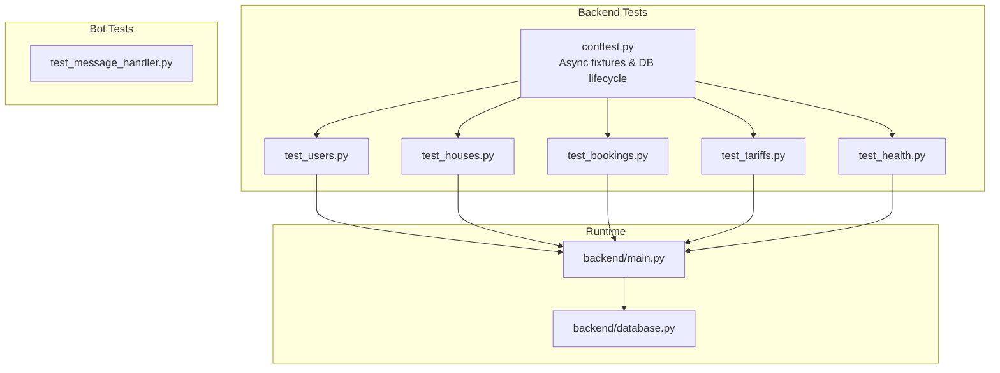
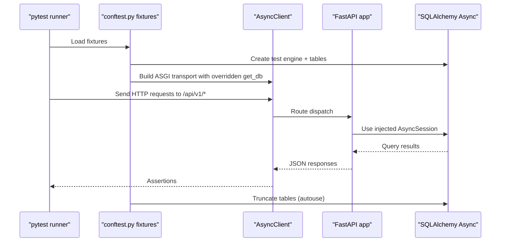
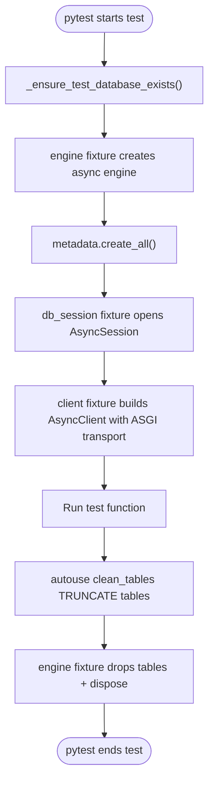
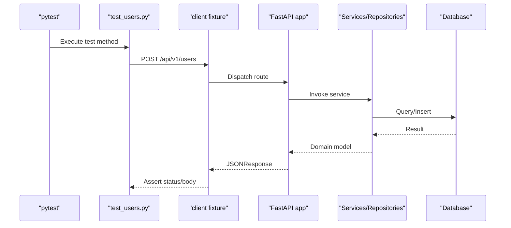
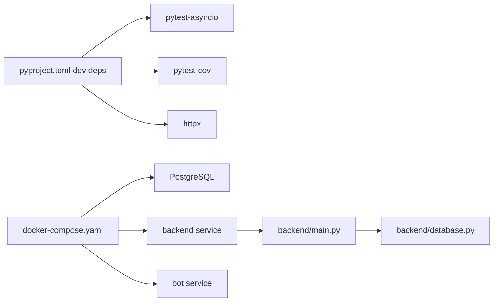

# Testing and Quality Assurance

<cite>
**Referenced Files in This Document**
- [conftest.py](file://backend/tests/conftest.py)
- [test_users.py](file://backend/tests/test_users.py)
- [test_houses.py](file://backend/tests/test_houses.py)
- [test_bookings.py](file://backend/tests/test_bookings.py)
- [test_tariffs.py](file://backend/tests/test_tariffs.py)
- [test_health.py](file://backend/tests/test_health.py)
- [test_message_handler.py](file://bot/tests/test_message_handler.py)
- [pyproject.toml](file://pyproject.toml)
- [docker-compose.yaml](file://docker-compose.yaml)
- [docker-compose.override.yml](file://docker-compose.override.yml)
- [main.py](file://backend/main.py)
- [database.py](file://backend/database.py)
</cite>

## Table of Contents
1. [Introduction](#introduction)
2. [Project Structure](#project-structure)
3. [Core Components](#core-components)
4. [Architecture Overview](#architecture-overview)
5. [Detailed Component Analysis](#detailed-component-analysis)
6. [Dependency Analysis](#dependency-analysis)
7. [Performance Considerations](#performance-considerations)
8. [Troubleshooting Guide](#troubleshooting-guide)
9. [Conclusion](#conclusion)
10. [Appendices](#appendices)

## Introduction
This document describes the testing and quality assurance strategy implemented with pytest across the backend and bot components. It explains unit and integration testing approaches, test organization, fixtures, and mocking strategies. It also covers async testing patterns, database cleanup, test data management, and continuous integration readiness. The goal is to help both beginners and experienced developers implement robust, maintainable test suites aligned with the project’s FastAPI, SQLAlchemy Async, and pytest-asyncio stack.

## Project Structure
The testing strategy is organized by module:
- Backend API tests under backend/tests/ with shared async fixtures and database lifecycle management
- Bot tests under bot/tests/ with focused unit tests for message handler logic and mocks
- Development and CI-ready configuration via pyproject.toml and docker-compose



**Diagram sources**
- [conftest.py:1-150](file://backend/tests/conftest.py#L1-L150)
- [test_users.py:1-386](file://backend/tests/test_users.py#L1-L386)
- [test_houses.py:1-760](file://backend/tests/test_houses.py#L1-L760)
- [test_bookings.py:1-876](file://backend/tests/test_bookings.py#L1-L876)
- [test_tariffs.py:1-271](file://backend/tests/test_tariffs.py#L1-L271)
- [test_health.py:1-21](file://backend/tests/test_health.py#L1-L21)
- [main.py:1-173](file://backend/main.py#L1-L173)
- [database.py:1-41](file://backend/database.py#L1-L41)

**Section sources**
- [conftest.py:1-150](file://backend/tests/conftest.py#L1-L150)
- [pyproject.toml:1-32](file://pyproject.toml#L1-L32)
- [docker-compose.yaml:1-43](file://docker-compose.yaml#L1-L43)
- [docker-compose.override.yml:1-13](file://docker-compose.override.yml#L1-L13)

## Core Components
- Async fixtures for database and HTTP client:
  - Engine fixture creates and tears down tables per test function
  - Session fixture ensures rollback after each test
  - HTTP client fixture overrides FastAPI dependency injection to use the test session
  - Autouse table truncation ensures a clean state between tests
  - Prerequisite fixtures create test_user, test_house, test_tariff for dependent tests
- Backend API tests:
  - Users, houses, tariffs, bookings endpoints with CRUD and business logic validations
  - Pagination, filtering, sorting, and error handling assertions
- Bot tests:
  - Unit tests for message handler functions using AsyncMock/MagicMock
  - Scenarios for booking creation, action execution, and error propagation
- Health checks:
  - Lightweight tests for service availability endpoints

**Section sources**
- [conftest.py:41-150](file://backend/tests/conftest.py#L41-L150)
- [test_users.py:6-386](file://backend/tests/test_users.py#L6-L386)
- [test_houses.py:6-760](file://backend/tests/test_houses.py#L6-L760)
- [test_bookings.py:6-876](file://backend/tests/test_bookings.py#L6-L876)
- [test_tariffs.py:6-271](file://backend/tests/test_tariffs.py#L6-L271)
- [test_health.py:1-21](file://backend/tests/test_health.py#L1-L21)
- [test_message_handler.py:1-177](file://bot/tests/test_message_handler.py#L1-L177)

## Architecture Overview
The testing architecture separates concerns across layers:
- Test fixtures manage async database lifecycle and HTTP client wiring
- API tests validate FastAPI routes and business logic
- Bot tests validate conversational logic and external service interactions via mocks
- Continuous integration readiness through dev dependencies and dockerized infrastructure



**Diagram sources**
- [conftest.py:41-107](file://backend/tests/conftest.py#L41-L107)
- [main.py:62-166](file://backend/main.py#L62-L166)
- [database.py:26-41](file://backend/database.py#L26-L41)

## Detailed Component Analysis

### Backend Test Organization and Fixtures
- Async database lifecycle:
  - Function-scoped engine avoids event loop conflicts
  - Tables created/dropped per test via metadata sync
- Session isolation:
  - Session opened per test, rolled back after completion
- HTTP client:
  - ASGITransport-based AsyncClient with dependency override for get_db
- Cleanup:
  - Autouse fixture truncates target tables with CASCADE to reset state
- Prerequisites:
  - test_user, test_house, test_tariff fixtures simplify dependent tests



**Diagram sources**
- [conftest.py:23-107](file://backend/tests/conftest.py#L23-L107)

**Section sources**
- [conftest.py:18-107](file://backend/tests/conftest.py#L18-L107)

### Unit Testing Patterns for API Endpoints
- Users:
  - Validation of role defaults, filtering, pagination, sorting, partial updates, and full replacement
- Houses:
  - Capacity and name validations, filtering by owner and activity, pagination, sorting, and calendar endpoint
- Tariffs:
  - Amount validations, CRUD operations, pagination, and sorting
- Bookings:
  - Date validation, conflict detection, amount calculation, guest composition updates, cancellation
- Health:
  - Basic service health endpoints



**Diagram sources**
- [test_users.py:9-93](file://backend/tests/test_users.py#L9-L93)
- [main.py:58-64](file://backend/main.py#L58-L64)
- [database.py:26-41](file://backend/database.py#L26-L41)

**Section sources**
- [test_users.py:6-386](file://backend/tests/test_users.py#L6-L386)
- [test_houses.py:6-760](file://backend/tests/test_houses.py#L6-L760)
- [test_tariffs.py:6-271](file://backend/tests/test_tariffs.py#L6-L271)
- [test_bookings.py:6-876](file://backend/tests/test_bookings.py#L6-L876)
- [test_health.py:1-21](file://backend/tests/test_health.py#L1-L21)

### Mocking Strategies for Bot Components
- Async functions mocked with AsyncMock to isolate handler logic
- Error propagation validated by catching and asserting on custom exceptions
- Integration points (external API) mocked to simulate success and failure paths

```mermaid
classDiagram
class TestCreateBooking {
+test_create_booking_success()
+test_create_booking_raises_error_when_house_not_found()
+test_create_booking_raises_error_on_api_failure()
}
class TestExecuteAction {
+test_execute_action_returns_cancel_reply_true_on_booking_error()
+test_execute_action_returns_cancel_reply_false_on_validation_error()
+test_execute_action_returns_none_on_success()
+test_execute_action_handles_null_action()
+test_execute_action_handles_unknown_action()
}
TestCreateBooking --> "AsyncMock backend" : "mocks get_houses/get_tariffs/create_booking"
TestExecuteAction --> "AsyncMock backend" : "mocks get_houses/get_tariffs/create_booking"
```

**Diagram sources**
- [test_message_handler.py:15-177](file://bot/tests/test_message_handler.py#L15-L177)

**Section sources**
- [test_message_handler.py:1-177](file://bot/tests/test_message_handler.py#L1-L177)

### Async Testing Patterns and Best Practices
- pytest-asyncio configured to auto mode
- Function-scoped engine fixtures to avoid event loop issues
- ASGITransport for HTTP client in place of deprecated app parameter
- Dependency overrides to inject test sessions into FastAPI routes

**Section sources**
- [conftest.py:18-92](file://backend/tests/conftest.py#L18-L92)
- [pyproject.toml:20-27](file://pyproject.toml#L20-L27)

### Database Cleanup and Test Data Management
- Autouse truncate ensures consistent state across tests
- Prerequisite fixtures create related entities to satisfy foreign keys
- Test database auto-created if missing using admin connection with AUTOCOMMIT

**Section sources**
- [conftest.py:95-150](file://backend/tests/conftest.py#L95-L150)

## Dependency Analysis
- Runtime dependencies:
  - FastAPI app registers routers and exception handlers
  - SQLAlchemy async engine/session factory
- Test dependencies:
  - pytest, pytest-asyncio, pytest-cov for coverage
  - httpx for AsyncClient and ASGI transport
- Dockerized runtime supports local and CI environments



**Diagram sources**
- [pyproject.toml:20-27](file://pyproject.toml#L20-L27)
- [docker-compose.yaml:1-43](file://docker-compose.yaml#L1-L43)
- [main.py:1-173](file://backend/main.py#L1-L173)
- [database.py:1-41](file://backend/database.py#L1-L41)

**Section sources**
- [pyproject.toml:20-27](file://pyproject.toml#L20-L27)
- [docker-compose.yaml:1-43](file://docker-compose.yaml#L1-L43)
- [docker-compose.override.yml:1-13](file://docker-compose.override.yml#L1-L13)

## Performance Considerations
- Prefer function-scoped fixtures for async engines to avoid cross-test event loop contamination
- Use autouse cleanup judiciously; ensure TRUNCATE does not become a bottleneck in very large suites
- Keep test data minimal and reuse fixtures to reduce setup overhead
- Use pagination and filtering tests to validate backend query performance characteristics

## Troubleshooting Guide
Common issues and resolutions:
- Event loop mismatch errors:
  - Ensure function-scoped engine fixtures and avoid sharing engine/session across tests
- AsyncClient initialization errors:
  - Use ASGITransport(app=app) with AsyncClient
- Missing test database:
  - Confirm _ensure_test_database_exists() runs and admin connection uses AUTOCOMMIT
- Foreign key constraint failures:
  - Use prerequisite fixtures (test_user, test_house, test_tariff) to seed related entities
- Coverage reporting:
  - Run tests with pytest-cov enabled via dev dependencies

**Section sources**
- [conftest.py:18-107](file://backend/tests/conftest.py#L18-L107)
- [pyproject.toml:20-27](file://pyproject.toml#L20-L27)

## Conclusion
The project employs a robust pytest-based testing strategy with async fixtures, dependency overrides, and comprehensive API coverage. The bot tests leverage mocking to validate conversational flows independently of external services. The combination of autouse cleanup, prerequisite fixtures, and dockerized infrastructure provides a reliable foundation for continuous integration and ongoing quality assurance.

## Appendices

### Practical Examples Index
- Backend API tests:
  - Users: [test_users.py:9-93](file://backend/tests/test_users.py#L9-L93)
  - Houses: [test_houses.py:9-98](file://backend/tests/test_houses.py#L9-L98)
  - Tariffs: [test_tariffs.py:9-51](file://backend/tests/test_tariffs.py#L9-L51)
  - Bookings: [test_bookings.py:53-110](file://backend/tests/test_bookings.py#L53-L110)
  - Health: [test_health.py:10-21](file://backend/tests/test_health.py#L10-L21)
- Bot tests:
  - Message handler: [test_message_handler.py:15-177](file://bot/tests/test_message_handler.py#L15-L177)

### Continuous Integration and Coverage
- Dev dependencies include pytest, pytest-asyncio, httpx, and pytest-cov
- Docker Compose defines services for Postgres, backend, and bot
- Override configuration exposes backend locally for bot connectivity during tests

**Section sources**
- [pyproject.toml:20-27](file://pyproject.toml#L20-L27)
- [docker-compose.yaml:1-43](file://docker-compose.yaml#L1-L43)
- [docker-compose.override.yml:1-13](file://docker-compose.override.yml#L1-L13)