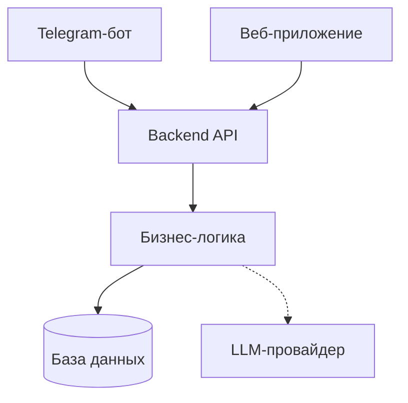

# Система бронирования загородного жилья

Платформа для бронирования гостевых домов естественным языком. Telegram-бот — первый интерфейс.

## О проекте

Организация загородного отдыха через переписки и таблицы — боль. Эта система заменяет их на естественный разговор: пользователь пишет *"Забронируй старый дом на следующие выходные, 6 человек"*, а бот понимает, уточняет детали и фиксирует бронирование.

**Ключевые пользователи:** арендаторы (бронируют дома) и арендодатели (управляют календарём и тарифами).

## Архитектура



## Статус

| Этап | Название | Статус |
|------|----------|--------|
| 0 | MVP Telegram-бот | 🚧 In Progress |
| 1 | Backend API и база данных | 📋 Planned |
| 2 | Веб-приложение для арендаторов | 📋 Planned |
| 3 | Панель управления арендодателя | 📋 Planned |
| 4 | Интеграции и автоматизация | 📋 Planned |

## Документация

- [Идея продукта](docs/idea.md)
- [Архитектурное видение](docs/vision.md)
- [Модель данных](docs/data-model.md)
- [Интеграции](docs/integrations.md)
- [План](docs/plan.md)
- [Задачи](docs/tasks/)

## Быстрый старт

### Локальная разработка (только бот)

```bash
# Установка зависимостей
make install

# Запуск бота
make run

# Линтинг
make lint

# Форматирование
make format
```

### Запуск полной системы (Docker)

```bash
# 1. Настройка окружения
cp .env.example .env
# Отредактируйте .env — добавьте TELEGRAM_BOT_TOKEN и ROUTERAI_API_KEY

# 2. Запуск инфраструктуры
docker compose up -d postgres

# 3. Применение миграций
docker compose run --rm backend uv run alembic upgrade head

# 4. Запуск backend
make run-backend

# 5. Проверка backend
curl http://localhost:8001/health

# 6. Запуск бота (в другом терминале)
make run
```

### Команды Makefile

```bash
# Backend
make run-backend      # Запуск backend в Docker
make stop-backend     # Остановка backend
make test-backend     # Запуск тестов backend
make migrate          # Применение миграций

# Database
make postgres-up      # Запуск PostgreSQL
make postgres-logs    # Логи PostgreSQL
```

**Требования:** Python 3.12+, [uv](https://docs.astral.sh/uv/), Docker

**Перед запуском:** скопируйте `.env.example` в `.env` и заполните токены.
