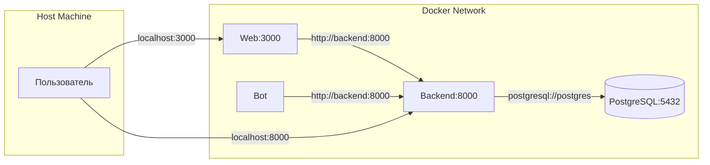
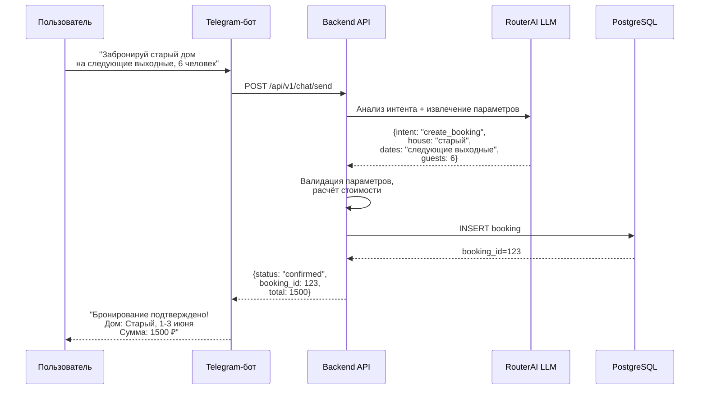
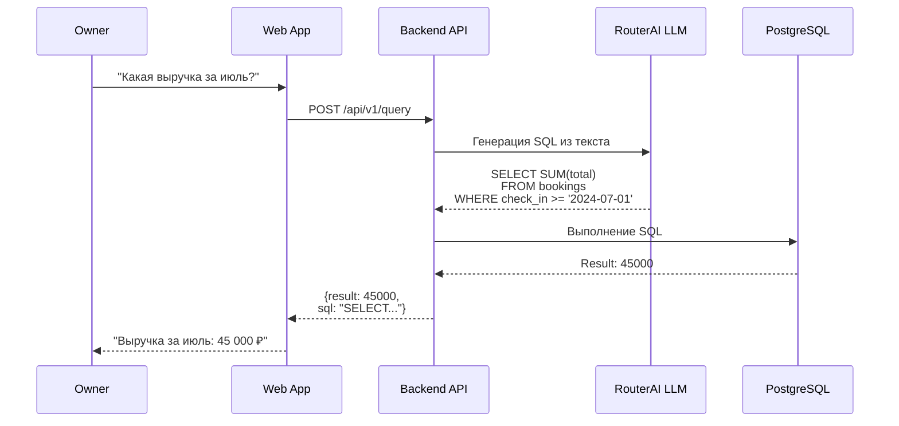

# Архитектура системы бронирования

> **Дата создания:** 12 апреля 2026  
> **Статус:** Актуальна  
> **Связанные документы:** [Техническое видение](vision.md), [Модель данных](data-model.md), [Интеграции](integrations.md)

---

## 1. Обзор системы

Платформа для бронирования загородного жилья через естественный язык. Пользователь пишет запрос на человеческом языке, система понимает намерение, уточняет детали и фиксирует бронирование.

**Ключевые пользователи:**
- **Арендатор (Tenant)** — бронирует дома, управляет своими бронированиями
- **Арендодатель (Owner)** — управляет домами, календарём, тарифами и аналитикой

---

## 2. Высокоуровневая архитектура

```mermaid
graph TB
    subgraph Клиенты
        TG[Telegram-бот<br/>Python + aiogram]
        WEB[Веб-приложение<br/>Next.js 15 + React 19]
    end

    subgraph Backend API<br/>FastAPI + SQLAlchemy 2.0
        API[API Router<br/>/api/v1/*]
        SVC[Service Layer<br/>Бизнес-логика]
        REPO[Repository Layer<br/>Доступ к данным]
        LLM[LLM Service<br/>RouterAI API]
        T2SQL[Text-to-SQL<br/>Service]
    end

    subgraph Данные
        DB[(PostgreSQL 16<br/>+ Alembic)]
    end

    TG -->|HTTP| API
    WEB -->|HTTP| API
    API --> SVC
    SVC --> REPO
    SVC -.->|Chat, NLU| LLM
    SVC -.->|Analytics| T2SQL
    REPO --> DB
    LLM -.->|OpenAI-compatible| ROUTERAI[RouterAI<br/>qwen3-max-thinking]
```

---

## 3. Компоненты системы

### 3.1 Backend API

**Технологии:** FastAPI, SQLAlchemy 2.0 (async), Pydantic V2, Alembic

**Структура:**
```
backend/
├── api/              # Роутеры (endpoints)
│   ├── bookings.py
│   ├── chat.py
│   ├── consumable_notes.py
│   ├── dashboard.py
│   ├── health.py
│   ├── houses.py
│   ├── query.py          # Text-to-SQL
│   ├── tariffs.py
│   └── users.py
├── services/         # Бизнес-логика
│   ├── booking.py
│   ├── chat.py
│   ├── consumable_note.py
│   ├── dashboard.py
│   ├── house.py
│   ├── llm.py            # Интеграция с LLM
│   ├── llm_tools.py      # Function calling
│   ├── tariff.py
│   ├── text_to_sql.py    # Text-to-SQL сервис
│   └── user.py
├── repositories/     # Слой доступа к данным
│   ├── booking.py
│   ├── chat.py
│   ├── consumable_note.py
│   ├── house.py
│   ├── tariff.py
│   └── user.py
├── models/           # SQLAlchemy модели
│   ├── booking.py
│   ├── chat.py
│   ├── consumable_note.py
│   ├── house.py
│   ├── tariff.py
│   └── user.py
├── schemas/          # Pydantic схемы
│   ├── booking.py
│   ├── chat.py
│   ├── consumable_note.py
│   ├── dashboard.py
│   ├── house.py
│   ├── query.py
│   ├── tariff.py
│   └── user.py
├── fixtures/         # Демо-данные
│   └── load_fixtures.py
├── config.py         # Pydantic-settings конфигурация
├── database.py       # Async engine, session factory
├── dependencies.py   # FastAPI зависимости
├── exceptions.py     # Кастомные исключения
└── main.py           # Точка входа
```

**Ключевые API endpoints:**
- `GET /api/v1/health` — проверка здоровья
- `GET/POST /api/v1/houses` — управление домами
- `GET/POST /api/v1/bookings` — управление бронированиями
- `GET/POST /api/v1/tariffs` — управление тарифами
- `GET/POST /api/v1/users` — управление пользователями
- `POST /api/v1/chat/*` — чат с LLM
- `POST /api/v1/query` — Text-to-SQL запросы
- `GET /api/v1/dashboard/*` — аналитика для owner/tenant
- `GET/POST /api/v1/consumable-notes` — учёт расходников

**Документация API:** Swagger UI доступен по адресу `http://localhost:8000/docs`

---

### 3.2 Telegram-бот

**Технологии:** Python 3.12+, aiogram 3.x, OpenAI SDK (RouterAI)

**Структура:**
```
bot/
├── handlers/         # Обработчики сообщений
│   └── message.py
├── services/         # Бизнес-логика бота
│   ├── backend_client.py  # HTTP клиент к backend API
│   └── llm.py             # LLM-интеграция
├── config.py         # Pydantic-конфигурация
└── main.py           # Точка входа
```

**Принцип работы:**
1. Пользователь пишет сообщение боту
2. Бот отправляет запрос к Backend API
3. Backend вызывает LLM для обработки естественного языка
4. LLM возвращает структурированный ответ (интент + параметры)
5. Backend выполняет действие (создаёт бронирование, ищет дома и т.д.)
6. Бот получает ответ и отправляет пользователю

---

### 3.3 Веб-приложение

**Технологии:** Next.js 15 (App Router), React 19, TypeScript 5, Tailwind CSS v4, shadcn/ui

**Структура:**
```
web/src/
├── app/              # Next.js App Router страницы
│   ├── layout.tsx
│   ├── page.tsx          # Авторизация
│   ├── dashboard/        # Панели dashboard
│   ├── leaderboard/      # Лидерборд
│   ├── chat/             # Полноэкранный чат
│   └── api/              # API routes (если нужны)
├── components/       # React компоненты
│   ├── ui/             # shadcn/ui компоненты
│   ├── dashboard/      # Компоненты дашборда
│   ├── leaderboard/    # Компоненты лидерборда
│   └── chat/           # Компоненты чата
├── hooks/            # Custom React hooks
│   ├── use-bookings.ts
│   ├── use-houses.ts
│   ├── use-chat.ts
│   ├── use-voice-input.ts
│   └── ...
├── lib/              # Утилиты и API клиент
│   └── api.ts
├── store/            # Zustand stores
│   ├── auth.ts
│   └── ui.ts
├── types/            # TypeScript типы
│   └── index.ts
└── middleware.ts     # Next.js middleware (аутентификация)
```

**Роли и маршруты:**
- `/dashboard` — общая панель (зависит от роли)
- `/leaderboard` — лидерборд бронирований
- `/chat` — полноэкранный чат с LLM
- Middleware проверяет роль и перенаправляет на соответствующий интерфейс

**State management:**
- **Zustand** — глобальное состояние (аутентификация, UI)
- **TanStack Query** — server state (кэширование API запросов)

**Голосовой ввод:** Web Speech API (browser-native)

---

## 4. Взаимодействие компонентов

### 4.1 Сетевая архитектура (Docker)



**Порты:**
| Сервис | Внутренний порт | Хост порт |
|--------|----------------|-----------|
| Backend | 8000 | 8000 |
| Frontend | 3000 | 3000 |
| PostgreSQL | 5432 | 5432 (не проброшен) |

**Переменные окружения:**
- `BACKEND_API_URL=http://backend:8000` — для бота (внутри Docker network)
- `NEXT_PUBLIC_API_URL=http://backend:8000/api/v1` — для frontend (внутри Docker network)
- При разработке с хоста: `NEXT_PUBLIC_API_URL=http://localhost:8000/api/v1`

---

### 4.2 Поток данных: Бронирование через бота



---

### 4.3 Поток данных: Text-to-SQL запрос



---

## 5. База данных

**СУБД:** PostgreSQL 16  
**Миграции:** Alembic  
**ORM:** SQLAlchemy 2.0 (async)

**Основные таблицы:**
- `users` — пользователи (tenants, owners)
- `houses` — дома для бронирования
- `bookings` — бронирования
- `tariffs` — тарифы
- `consumable_notes` — учёт расходников
- `chats` + `chat_messages` — история чатов
- `calendar` — календарь доступности

**Схема детализирована:** [data-model.md](data-model.md)

**Миграции:**
```bash
make migrate           # Применить все миграции
make migrate-create    # Создать новую миграцию
make migrate-down      # Откатить последнюю миграцию
```

---

## 6. LLM-интеграция

**Провайдер:** RouterAI (OpenAI-compatible API)  
**Модель:** `openrouter/qwen/qwen3-max-thinking`  
**SDK:** OpenAI Python SDK с кастомным `base_url`

**Использование:**
1. **Обработка естественного языка** — понимание интентов пользователя в боте и веб-чате
2. **Function calling** — извлечение параметров для бронирования, поиска домов и т.д.
3. **Text-to-SQL** — генерация SQL-запросов из вопросов на естественном языке

**Конфигурация:**
```env
ROUTERAI_API_KEY=your_key
ROUTERAI_BASE_URL=https://routerai.ru/api/v1
LLM_MODEL=openrouter/qwen/qwen3-max-thinking
```

---

## 7. Развёртывание

### 7.1 Development

```bash
# 1. Настройка окружения
cp .env.example .env
# Заполнить токены (см. docs/how-to-get-tokens.md)

# 2. Запуск системы
make postgres-up      # Запуск PostgreSQL
make migrate          # Применение миграций
make fixtures         # Загрузка демо-данных (опционально)
make run-backend      # Запуск backend
make run-frontend     # Запуск frontend (localhost:3000)
make run              # Запуск бота (в другом терминале)
```

### 7.2 Production

Текущая конфигурация предназначена для development. Для production требуется:
- Настройка обратного прокси (Nginx/Traefik)
- HTTPS сертификаты
- Переменные окружения для production (секреты, БД)
- Health checks и monitoring
- CI/CD пайплайн

---

## 8. Диагностика

### 8.1 Проверка здоровья

```bash
# Backend health
curl http://localhost:8000/api/v1/health

# Ожидаемый ответ:
# {"status": "ok", "database": "connected"}
```

### 8.2 Логи сервисов

```bash
make run-backend-logs   # Логи backend
make postgres-logs      # Логи PostgreSQL
docker compose logs web # Логи frontend
```

### 8.3 Swagger UI

Backend API документация: http://localhost:8000/docs

---

## 9. Связанные документы

- [Техническое видение](vision.md) — общее видение проекта
- [Модель данных](data-model.md) — детальная ER-диаграмма
- [Интеграции](integrations.md) — внешние сервисы
- [API контракты](tech/api-contracts.md) — документация всех endpoints
- [Сценарии чата](specs/chatflow.md) — маппинг интентов
- [UI спецификация](specs/screenflow.md) — экраны и переходы
- [ADRs](adr/) — архитектурные решения
