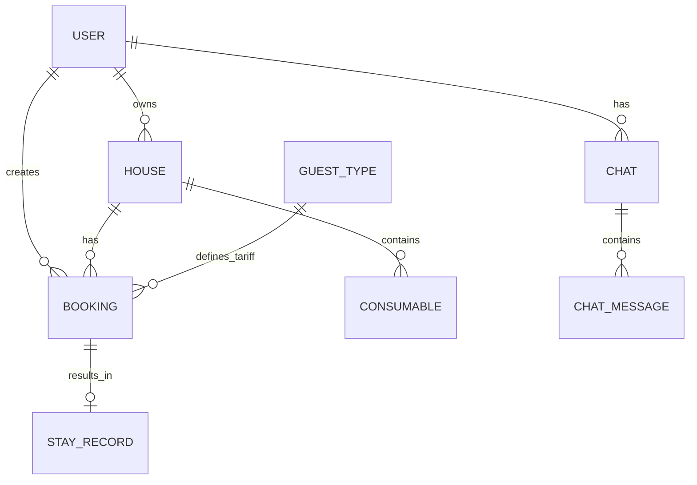
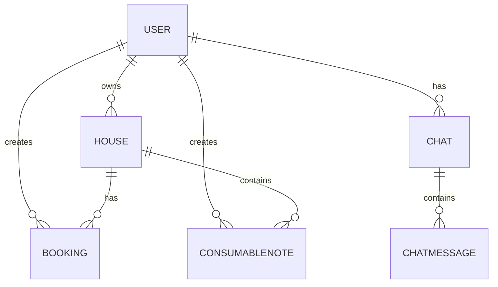

# Модель данных

## Сценарии использования

### Арендатор (Tenant)

| Сценарий | Необходимые данные |
|----------|-------------------|
| Просмотр списка домов | House: id, name, description, capacity, is_active |
| Просмотр деталей дома | House: все поля |
| Просмотр календаря занятости | Booking: house_id, check_in, check_out, status |
| Создание бронирования | Booking: все поля; Tariff: для расчёта стоимости |
| Просмотр своих бронирований | Booking: tenant_id, фильтры по датам и статусу |
| Отмена бронирования | Booking: id, status |
| Фиксация результатов поездки | Booking: guests_actual; StayRecord: фактические данные |

### Арендодатель (Owner)

| Сценарий | Необходимые данные |
|----------|-------------------|
| Просмотр своих домов | House: owner_id |
| Управление календарём доступности | House: id; Booking: блокировка дат |
| Просмотр всех бронирований | Booking: все поля + фильтры |
| Управление тарифами | Tariff: все поля |
| Контроль остатков расходников | ConsumableNote: house_id, name, comment |

### Общие сценарии (чат и ассистент)

| Сценарий | Необходимые данные |
|----------|-------------------|
| Создание чата с ассистентом | Chat: user_id, title |
| Отправка сообщения | ChatMessage: chat_id, role, content |
| Просмотр истории чата | ChatMessage: chat_id, role, content, created_at |
| Text-to-SQL запрос | ChatMessage + LLM-генерация SQL |

## Основные сущности

### User (Пользователь)
Представляет любого участника системы — арендатора или арендодателя.

**Поля:**

| Поле | Тип | Описание |
|------|-----|----------|
| `id` | Integer (PK) | Уникальный идентификатор |
| `telegram_id` | String (unique) | ID в Telegram (для входа через бот) |
| `name` | String(100) | Имя для отображения |
| `role` | Enum | Роль: `tenant` / `owner` / `both` |
| `created_at` | DateTime | Дата регистрации (автоматически)

### House (Дом)
Объект бронирования с характеристиками и оснащением.

**Поля:**

| Поле | Тип | Описание |
|------|-----|----------|
| `id` | Integer (PK) | Уникальный идентификатор |
| `name` | String(100) | Название ("Старый дом", "Новый дом") |
| `description` | String(1000) | Описание |
| `capacity` | Integer | Максимальная вместимость (гостей) |
| `owner_id` | Integer (FK) | Владелец (ссылка на users.id) |
| `is_active` | Boolean | Доступен для бронирования (default: true) |
| `created_at` | DateTime | Дата создания (автоматически)

### Booking (Бронирование)
Запрос на проживание с датами и составом группы.

**Поля:**

| Поле | Тип | Описание |
|------|-----|----------|
| `id` | Integer (PK) | Уникальный идентификатор |
| `house_id` | Integer (FK) | Забронированный дом (ссылка на houses.id) |
| `tenant_id` | Integer (FK) | Кто бронирует (ссылка на users.id) |
| `check_in` | Date | Дата заезда |
| `check_out` | Date | Дата выезда |
| `guests_planned` | JSON | Планируемый состав группы: `[{"tariff_id": 1, "count": 2}]` |
| `guests_actual` | JSON | Фактический состав (заполняется после проживания) |
| `total_amount` | Integer | Итоговая сумма в копейках (пересчитывается после проживания) |
| `status` | Enum | Статус: `pending` / `confirmed` / `cancelled` / `completed` |
| `created_at` | DateTime | Дата создания (автоматически)

### Tariff (Тариф)
Справочник тарифов для типов гостей.

**Поля:**

| Поле | Тип | Описание |
|------|-----|----------|
| `id` | Integer (PK) | Уникальный идентификатор |
| `name` | String(100) | Название ("Ребёнок", "Взрослый", "Постоянный гость") |
| `amount` | Integer | Стоимость проживания в копейках (0 для бесплатных) |
| `created_at` | DateTime | Дата создания (автоматически)

### ConsumableNote (Заметка о расходниках)
Запись об остатках в доме. Создаётся арендатором после проживания или обновляется в любой момент.

- `id` — уникальный идентификатор
- `house_id` — к какому дому относится
- `created_by` — кто создал запись (арендатор или арендодатель)
- `name` — название категории ("Дрова", "Продукты")
- `comment` — свободное описание ("6 пачек", "5 булок хлеба, 6 банок тушенки")
- `created_at` — дата создания

### Chat (Чат)
Диалог пользователя с ассистентом. Каждый пользователь может иметь несколько чатов.

**Поля:**

| Поле | Тип | Описание |
|------|-----|----------|
| `id` | Integer (PK) | Уникальный идентификатор |
| `user_id` | Integer (FK) | Владелец чата (ссылка на users.id) |
| `title` | String(200) | Заголовок чата (опционально) |
| `created_at` | DateTime | Дата создания (автоматически) |
| `updated_at` | DateTime | Дата последнего обновления |

### ChatMessage (Сообщение чата)
Отдельное сообщение в чате. Принадлежит роли: user, assistant или system.

**Поля:**

| Поле | Тип | Описание |
|------|-----|----------|
| `id` | Integer (PK) | Уникальный идентификатор |
| `chat_id` | Integer (FK) | Чат, к которому относится сообщение |
| `role` | String(20) | Роль: `user` / `assistant` / `system` |
| `content` | Text | Текст сообщения |
| `created_at` | DateTime | Дата создания (автоматически) |

### StayRecord (Запись о проживании)
Фактические результаты поездки — фиксируется после выезда.

- `id` — уникальный идентификатор
- `booking_id` — связанное бронирование
- `guests_breakdown` — фактическое количество по типам гостей, структура `{tariff_id: count}`
- `notes` — заметки об условиях и впечатлениях
- `recorded_at` — дата фиксации

---

## Связи между сущностями



**Ключевые связи:**
- Арендодатель владеет одним или несколькими домами
- Арендатор создаёт бронирования на дома
- Каждое бронирование привязано к одному дому
- Дом имеет историю заметок о расходниках
- Бронирование может иметь одну запись о фактическом проживании
- Типы гостей определяют тарифы для бронирований
- Пользователь может иметь несколько чатов с ассистентом
- Каждый чат содержит историю сообщений

---

## Физическая модель (PostgreSQL)

### Таблицы

#### users

| Поле | Тип PostgreSQL | Constraints | Описание |
|------|----------------|-------------|----------|
| id | `BIGINT GENERATED ALWAYS AS IDENTITY` | PRIMARY KEY | Уникальный идентификатор |
| telegram_id | `TEXT` | UNIQUE, NOT NULL | ID в Telegram |
| name | `VARCHAR(100)` | NOT NULL | Имя для отображения |
| role | `USER_ROLE` (enum) | NOT NULL, DEFAULT 'tenant' | Роль пользователя |
| created_at | `TIMESTAMPTZ` | NOT NULL, DEFAULT now() | Дата регистрации |

**Индексы:**
- `PRIMARY KEY` на id
- `UNIQUE` на telegram_id

#### houses

| Поле | Тип PostgreSQL | Constraints | Описание |
|------|----------------|-------------|----------|
| id | `BIGINT GENERATED ALWAYS AS IDENTITY` | PRIMARY KEY | Уникальный идентификатор |
| name | `VARCHAR(100)` | NOT NULL | Название дома |
| description | `TEXT` | | Описание |
| capacity | `INTEGER` | NOT NULL, CHECK > 0 | Максимальная вместимость |
| owner_id | `BIGINT` | FOREIGN KEY → users.id, NOT NULL | Владелец |
| is_active | `BOOLEAN` | NOT NULL, DEFAULT true | Доступен для бронирования |
| created_at | `TIMESTAMPTZ` | NOT NULL, DEFAULT now() | Дата создания |

**Индексы:**
- `PRIMARY KEY` на id
- `INDEX` на owner_id (для фильтра по владельцу)
- `INDEX` на is_active (для фильтра активных)

#### bookings

| Поле | Тип PostgreSQL | Constraints | Описание |
|------|----------------|-------------|----------|
| id | `BIGINT GENERATED ALWAYS AS IDENTITY` | PRIMARY KEY | Уникальный идентификатор |
| house_id | `BIGINT` | FOREIGN KEY → houses.id, NOT NULL | Забронированный дом |
| tenant_id | `BIGINT` | FOREIGN KEY → users.id, NOT NULL | Кто бронирует |
| check_in | `DATE` | NOT NULL | Дата заезда |
| check_out | `DATE` | NOT NULL, CHECK > check_in | Дата выезда |
| guests_planned | `JSONB` | NOT NULL | Планируемый состав группы |
| guests_actual | `JSONB` | | Фактический состав |
| total_amount | `INTEGER` | CHECK >= 0 | Итоговая сумма (копейки) |
| status | `BOOKING_STATUS` (enum) | NOT NULL, DEFAULT 'pending' | Статус бронирования |
| created_at | `TIMESTAMPTZ` | NOT NULL, DEFAULT now() | Дата создания |

**Индексы:**
- `PRIMARY KEY` на id
- `INDEX` на house_id (для фильтра по дому)
- `INDEX` на tenant_id (для фильтра по арендатору)
- `INDEX` на status (для фильтра по статусу)
- `INDEX` на (check_in, check_out) (для диапазонных запросов)

#### tariffs

| Поле | Тип PostgreSQL | Constraints | Описание |
|------|----------------|-------------|----------|
| id | `BIGINT GENERATED ALWAYS AS IDENTITY` | PRIMARY KEY | Уникальный идентификатор |
| name | `VARCHAR(100)` | NOT NULL | Название тарифа |
| amount | `INTEGER` | NOT NULL, CHECK >= 0 | Стоимость (копейки) |
| created_at | `TIMESTAMPTZ` | NOT NULL, DEFAULT now() | Дата создания |

**Индексы:**
- `PRIMARY KEY` на id

#### consumable_notes

| Поле | Тип PostgreSQL | Constraints | Описание |
|------|----------------|-------------|----------|
| id | `BIGINT GENERATED ALWAYS AS IDENTITY` | PRIMARY KEY | Уникальный идентификатор |
| house_id | `BIGINT` | FOREIGN KEY → houses.id, NOT NULL | Дом |
| created_by | `BIGINT` | FOREIGN KEY → users.id, NOT NULL | Кто создал |
| name | `VARCHAR(100)` | NOT NULL | Название категории |
| comment | `TEXT` | | Описание остатков |
| created_at | `TIMESTAMPTZ` | NOT NULL, DEFAULT now() | Дата создания |

**Индексы:**
- `PRIMARY KEY` на id
- `INDEX` на house_id (для фильтра по дому)

#### chats

| Поле | Тип PostgreSQL | Constraints | Описание |
|------|----------------|-------------|----------|
| id | `BIGINT GENERATED ALWAYS AS IDENTITY` | PRIMARY KEY | Уникальный идентификатор |
| user_id | `BIGINT` | FOREIGN KEY → users.id, NOT NULL | Владелец чата |
| title | `VARCHAR(200)` | | Заголовок чата |
| created_at | `TIMESTAMPTZ` | NOT NULL, DEFAULT now() | Дата создания |
| updated_at | `TIMESTAMPTZ` | | Дата последнего обновления |

**Индексы:**
- `PRIMARY KEY` на id
- `INDEX` на user_id (для фильтра по пользователю)

#### chat_messages

| Поле | Тип PostgreSQL | Constraints | Описание |
|------|----------------|-------------|----------|
| id | `BIGINT GENERATED ALWAYS AS IDENTITY` | PRIMARY KEY | Уникальный идентификатор |
| chat_id | `BIGINT` | FOREIGN KEY → chats.id, NOT NULL | Чат сообщения |
| role | `VARCHAR(20)` | NOT NULL | Роль: user/assistant/system |
| content | `TEXT` | NOT NULL | Текст сообщения |
| created_at | `TIMESTAMPTZ` | NOT NULL, DEFAULT now() | Дата создания |

**Индексы:**
- `PRIMARY KEY` на id
- `INDEX` на chat_id (для фильтра по чату)

### ER-диаграмма



### Enums

```sql
CREATE TYPE user_role AS ENUM ('tenant', 'owner', 'both');
CREATE TYPE booking_status AS ENUM ('pending', 'confirmed', 'cancelled', 'completed');
```

## Выбор СУБД

### MVP: PostgreSQL

**Обоснование:**
- Полноценная реляционная модель с поддержкой JSON для гибких полей (состав гостей)
- Проверенное решение, не требует дополнительного обучения команды
- Поддержка транзакций для консистентности бронирований
- Легко деплоится на Railway, Render и аналогичных платформах

### Дальнейшее развитие: PostgreSQL + Redis

**PostgreSQL** остаётся основной СУБД для персистентных данных.

**Redis** добавляется для:
- Кэширования календарей доступности (частые чтения)
- Сессий и временных состояний
- Очередей задач (уведомления, пересчёт тарифов)

**При масштабировании:**
- Репликация PostgreSQL для чтения
- Шардирование по домам при необходимости
- Миграция на managed-решения (AWS RDS, Supabase) без смены СУБД
