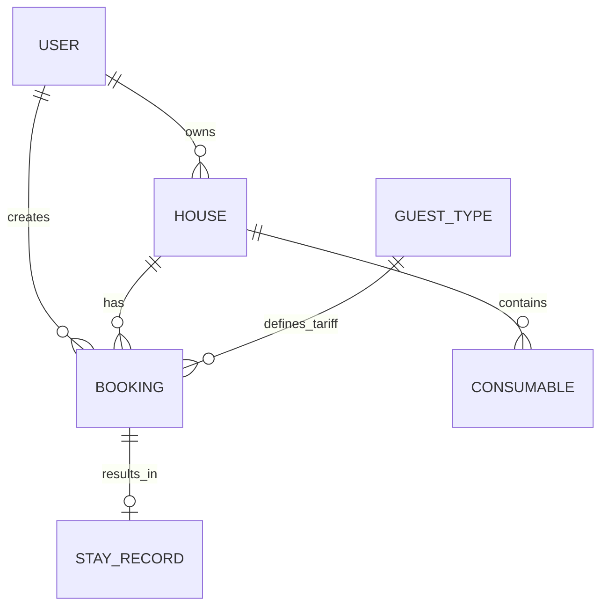

# Модель данных

## Основные сущности

### User (Пользователь)
Представляет любого участника системы — арендатора или арендодателя.

**Поля:**

| Поле | Тип | Описание |
|------|-----|----------|
| `id` | Integer (PK) | Уникальный идентификатор |
| `telegram_id` | String (unique) | ID в Telegram (для входа через бот) |
| `name` | String(100) | Имя для отображения |
| `role` | Enum | Роль: `tenant` / `owner` / `both` |
| `created_at` | DateTime | Дата регистрации (автоматически)

### House (Дом)
Объект бронирования с характеристиками и оснащением.

**Поля:**

| Поле | Тип | Описание |
|------|-----|----------|
| `id` | Integer (PK) | Уникальный идентификатор |
| `name` | String(100) | Название ("Старый дом", "Новый дом") |
| `description` | String(1000) | Описание |
| `capacity` | Integer | Максимальная вместимость (гостей) |
| `owner_id` | Integer (FK) | Владелец (ссылка на users.id) |
| `is_active` | Boolean | Доступен для бронирования (default: true) |
| `created_at` | DateTime | Дата создания (автоматически)

### Booking (Бронирование)
Запрос на проживание с датами и составом группы.

**Поля:**

| Поле | Тип | Описание |
|------|-----|----------|
| `id` | Integer (PK) | Уникальный идентификатор |
| `house_id` | Integer (FK) | Забронированный дом (ссылка на houses.id) |
| `tenant_id` | Integer (FK) | Кто бронирует (ссылка на users.id) |
| `check_in` | Date | Дата заезда |
| `check_out` | Date | Дата выезда |
| `guests_planned` | JSON | Планируемый состав группы: `[{"tariff_id": 1, "count": 2}]` |
| `guests_actual` | JSON | Фактический состав (заполняется после проживания) |
| `total_amount` | Integer | Итоговая сумма в копейках (пересчитывается после проживания) |
| `status` | Enum | Статус: `pending` / `confirmed` / `cancelled` / `completed` |
| `created_at` | DateTime | Дата создания (автоматически)

### Tariff (Тариф)
Справочник тарифов для типов гостей.

**Поля:**

| Поле | Тип | Описание |
|------|-----|----------|
| `id` | Integer (PK) | Уникальный идентификатор |
| `name` | String(100) | Название ("Ребёнок", "Взрослый", "Постоянный гость") |
| `amount` | Integer | Стоимость проживания в копейках (0 для бесплатных) |
| `created_at` | DateTime | Дата создания (автоматически)

### ConsumableNote (Заметка о расходниках)
Запись об остатках в доме. Создаётся арендатором после проживания или обновляется в любой момент.

- `id` — уникальный идентификатор
- `house_id` — к какому дому относится
- `created_by` — кто создал запись (арендатор или арендодатель)
- `name` — название категории ("Дрова", "Продукты")
- `comment` — свободное описание ("6 пачек", "5 булок хлеба, 6 банок тушенки")
- `created_at` — дата создания

### StayRecord (Запись о проживании)
Фактические результаты поездки — фиксируется после выезда.

- `id` — уникальный идентификатор
- `booking_id` — связанное бронирование
- `guests_breakdown` — фактическое количество по типам гостей, структура `{tariff_id: count}`
- `notes` — заметки об условиях и впечатлениях
- `recorded_at` — дата фиксации

---

## Связи между сущностями

**Ключевые связи:**
- Арендодатель владеет одним или несколькими домами
- Арендатор создаёт бронирования на дома
- Каждое бронирование привязано к одному дому
- Дом имеет историю заметок о расходниках
- Бронирование может иметь одну запись о фактическом проживании
- Типы гостей определяют тарифы для бронирований

---

## Выбор СУБД

### MVP: PostgreSQL

**Обоснование:**
- Полноценная реляционная модель с поддержкой JSON для гибких полей (состав гостей)
- Проверенное решение, не требует дополнительного обучения команды
- Поддержка транзакций для консистентности бронирований
- Легко деплоится на Railway, Render и аналогичных платформах

### Дальнейшее развитие: PostgreSQL + Redis

**PostgreSQL** остаётся основной СУБД для персистентных данных.

**Redis** добавляется для:
- Кэширования календарей доступности (частые чтения)
- Сессий и временных состояний
- Очередей задач (уведомления, пересчёт тарифов)

**При масштабировании:**
- Репликация PostgreSQL для чтения
- Шардирование по домам при необходимости
- Миграция на managed-решения (AWS RDS, Supabase) без смены СУБД
