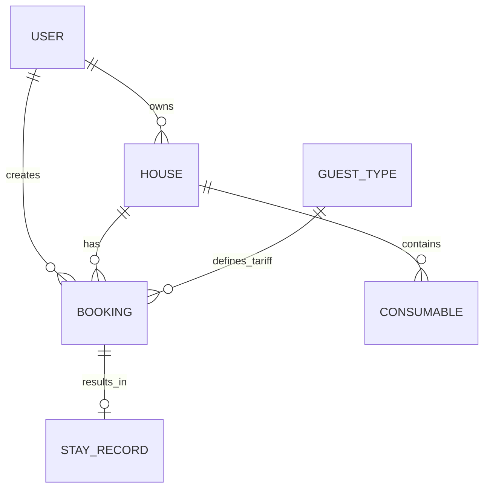

# Модель данных

## Основные сущности

### User (Пользователь)
Представляет любого участника системы — арендатора или арендодателя.

- `id` — уникальный идентификатор
- `telegram_id` — ID в Telegram (для входа через бот)
- `role` — роль: арендатор / арендодатель / обе
- `name` — имя для отображения
- `created_at` — дата регистрации

### House (Дом)
Объект бронирования с характеристиками и оснащением.

- `id` — уникальный идентификатор
- `name` — название ("Старый дом", "Новый дом")
- `description` — описание
- `capacity` — максимальная вместимость (гостей)
- `owner_id` — владелец (арендодатель)
- `is_active` — доступен для бронирования

### Booking (Бронирование)
Запрос на проживание с датами и составом группы.

- `id` — уникальный идентификатор
- `house_id` — забронированный дом
- `tenant_id` — кто бронирует (арендатор)
- `check_in` / `check_out` — даты заезда и выезда
- `guests_planned` — планируемый состав группы (типы гостей)
- `guests_actual` — фактический состав (заполняется после проживания)
- `total_amount` — итоговая сумма (пересчитывается после проживания)
- `status` — статус: запрошено / подтверждено / отменено / завершено
- `created_at` — дата создания

### Tariff (Тариф)
Справочник тарифов для типов гостей.

- `id` — уникальный идентификатор
- `name` — название ("Ребёнок", "Взрослый", "Постоянный гость")
- `amount` — стоимость проживания (0 для бесплатных)

### ConsumableNote (Заметка о расходниках)
Запись об остатках в доме. Создаётся арендатором после проживания или обновляется в любой момент.

- `id` — уникальный идентификатор
- `house_id` — к какому дому относится
- `created_by` — кто создал запись (арендатор или арендодатель)
- `name` — название категории ("Дрова", "Продукты")
- `comment` — свободное описание ("6 пачек", "5 булок хлеба, 6 банок тушенки")
- `created_at` — дата создания

### StayRecord (Запись о проживании)
Фактические результаты поездки — фиксируется после выезда.

- `id` — уникальный идентификатор
- `booking_id` — связанное бронирование
- `guests_breakdown` — фактическое количество по типам гостей, структура `{tariff_id: count}`
- `notes` — заметки об условиях и впечатлениях
- `recorded_at` — дата фиксации

---

## Связи между сущностями

**Ключевые связи:**
- Арендодатель владеет одним или несколькими домами
- Арендатор создаёт бронирования на дома
- Каждое бронирование привязано к одному дому
- Дом имеет историю заметок о расходниках
- Бронирование может иметь одну запись о фактическом проживании
- Типы гостей определяют тарифы для бронирований

---

## Выбор СУБД

### MVP: PostgreSQL

**Обоснование:**
- Полноценная реляционная модель с поддержкой JSON для гибких полей (состав гостей)
- Проверенное решение, не требует дополнительного обучения команды
- Поддержка транзакций для консистентности бронирований
- Легко деплоится на Railway, Render и аналогичных платформах

### Дальнейшее развитие: PostgreSQL + Redis

**PostgreSQL** остаётся основной СУБД для персистентных данных.

**Redis** добавляется для:
- Кэширования календарей доступности (частые чтения)
- Сессий и временных состояний
- Очередей задач (уведомления, пересчёт тарифов)

**При масштабировании:**
- Репликация PostgreSQL для чтения
- Шардирование по домам при необходимости
- Миграция на managed-решения (AWS RDS, Supabase) без смены СУБД
