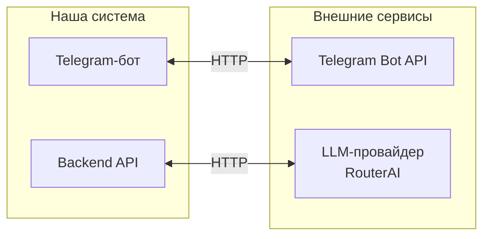

# Внешние интеграции

## Диаграмма интеграций

---

## Внешние системы

### Telegram Bot API
- **Сервис:** [core.telegram.org/bots/api](https://core.telegram.org/bots/api)
- **Назначение:** Получение сообщений от пользователей, отправка ответов
- **Направление:** Bidirectional (in: сообщения, out: ответы)
- **Протокол:** HTTPS, Webhook или Long Polling
- **Критичность:** MVP — без Telegram нет продукта

### LLM-провайдер (RouterAI)
- **Сервис:** [routerai.ru](https://routerai.ru)
- **Назначение:** Обработка естественного языка, извлечение намерений, генерация ответов
- **Направление:** Out (запросы к API)
- **Протокол:** OpenAI-compatible REST API (HTTPS)
- **Критичность:** MVP — бот не работает без LLM

---

## Зависимости и риски

| Интеграция | Критичность | Риск | Митигация |
|------------|-------------|------|-----------|
| Telegram Bot API | Высокая | Блокировка, rate limits | Fallback на webhook, retry-логика |
| RouterAI | Высокая | Недоступность, изменение API | Кэширование, fallback на шаблоны |

**Ключевые зависимости:**
- MVP полностью зависит от Telegram и RouterAI
- Нужен резервный LLM-провайдер на случай сбоев

**Рекомендации:**
- Логировать все внешние вызовы
- Реализовать circuit breaker для LLM
- Хранить токены и ключи в env, не в коде
