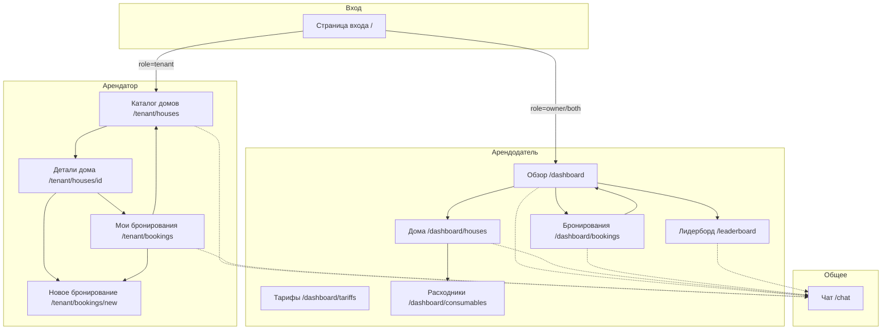

# Screen Flow Frontend

## Обзор

Документ описывает полную структуру экранов веб-приложения системы бронирования загородного жилья, переходы между ними и ожидаемое поведение интерфейса для обеих ролей: арендатора и арендодателя.

---

## Общая схема навигации



---

## Страница входа

**Маршрут:** `/`

**Доступ:** Публичный (неавторизованные пользователи)

### Описание

Страница авторизации через ввод Telegram username. Единая точка входа для всех пользователей.

### Элементы интерфейса

| Элемент | Тип | Описание |
|---------|-----|----------|
| Заголовок | Text | "Вход в систему" |
| Подзаголовок | Text | "Введите ваш Telegram username для входа" |
| Поле username | Input | Placeholder: `@username` |
| Кнопка "Войти" | Button | Отправка формы |

### Поведение

1. **При загрузке:**
   - Проверяется наличие cookie `user_role`
   - Если `role=tenant` → редирект на `/tenant/houses`
   - Если `role=owner` или `role=both` → редирект на `/dashboard`

2. **При отправке формы:**
   - Валидация: поле не должно быть пустым
   - Запрос к API: `GET /users/telegram/{username}`
   - При успехе:
     - Сохранение пользователя в Zustand store
     - Установка cookie `user_role`
     - Редирект на страницу по роли
   - При ошибке: toast "Пользователь не найден"

3. **Состояния:**
   - `idle` — начальное состояние
   - `loading` — "Вход..." с отключенной кнопкой
   - `error` — toast с сообщением об ошибке

### Переходы

| Роль | Страница назначения |
|------|---------------------|
| tenant | `/tenant/houses` (Каталог домов) |
| owner | `/dashboard` (Обзор) |
| both | `/dashboard` (Обзор) |

---

## Интерфейс арендатора (Tenant)

### Каталог домов

**Маршрут:** `/tenant/houses`

**Доступ:** Только арендатор

### Описание

Главная страница арендатора. Отображает список всех активных домов, доступных для бронирования.

### Элементы интерфейса

| Элемент | Тип | Описание |
|---------|-----|----------|
| Заголовок | Text | "Доступные дома" |
| Карточка дома | Card | Название, описание, вместимость, кнопка "Подробнее" |
| Иконка вместимости | Icon + Text | `Users` icon + "X гостей" |

### Макет карточки дома

```
┌─────────────────────────────────────┐
│ [Название дома]                     │
│ [Описание дома в 1-2 строки...]     │
│ 👥 X гостей          [Подробнее →]  │
└─────────────────────────────────────┘
```

### Поведение

1. **При загрузке:**
   - Запрос к API: `GET /houses?is_active=true`
   - Показ skeleton-заглушек (3 карточки)

2. **При пустом списке:**
   - Карточка: "Нет доступных домов для бронирования"

3. **При клике на "Подробнее":**
   - Переход на `/tenant/houses/{id}`

4. **При клике на карточку:**
   - Переход на `/tenant/houses/{id}`

### Переходы

| Действие | Страница назначения |
|----------|---------------------|
| Клик на карточку/кнопку | `/tenant/houses/{id}` (Детали дома) |

---

### Детали дома

**Маршрут:** `/tenant/houses/[id]`

**Доступ:** Только арендатор

### Описание

Страница с полной информацией о доме, календарём занятости и возможностью забронировать.

### Элементы интерфейса

| Элемент | Тип | Описание |
|---------|-----|----------|
| Кнопка "Назад" | Button + Icon | Стрелка влево, возврат к каталогу |
| Название дома | Text (H1) | Название дома |
| Описание | Text | Полное описание |
| Вместимость | Badge + Icon | `Users` icon + "до X гостей" |
| Календарь занятости | Calendar | Визуализация занятых/свободных дат |
| Кнопка "Забронировать" | Button | Переход к созданию бронирования |

### Макет

```
┌─────────────────────────────────────────────────┐
│ [← Назад к домам]                               │
│                                                 │
│ [Название дома]                     [👥 до X гостей] │
│                                                 │
│ [Полное описание дома...]                       │
│                                                 │
│ ┌─────────────────────────────────────────────┐ │
│ │ Календарь занятости                         │ │
│ │ [Месяц] [Год]                               │ │
│ │ Пн Вт Ср Чт Пт Сб Вс                        │ │
│ │ [Занятые даты выделены цветом]              │ │
│ └─────────────────────────────────────────────┘ │
│                                                 │
│                        [Забронировать дом]      │
└─────────────────────────────────────────────────┘
```

### Поведение

1. **При загрузке:**
   - Запрос к API: `GET /houses/{id}` — детали дома
   - Запрос к API: `GET /houses/{id}/calendar` — данные календаря
   - Показ skeleton-заглушек

2. **Календарь занятости:**
   - Занятые даты выделены красным/серым цветом
   - Свободные даты — зелёным/белым
   - Можно выбрать период для бронирования

3. **При клике "Забронировать":**
   - Если выбраны даты в календаре: переход на `/tenant/bookings/new?houseId={id}&checkIn={date}&checkOut={date}`
   - Если даты не выбраны: переход на `/tenant/bookings/new?houseId={id}`

### Переходы

| Действие | Страница назначения |
|----------|---------------------|
| Кнопка "Назад" | `/tenant/houses` (Каталог домов) |
| Кнопка "Забронировать" | `/tenant/bookings/new?houseId={id}` (Новое бронирование) |

---

### Мои бронирования

**Маршрут:** `/tenant/bookings`

**Доступ:** Только арендатор

### Описание

Страница со списком бронирований текущего пользователя. Возможность просмотра, отмены и фиксации результатов поездки.

### Элементы интерфейса

| Элемент | Тип | Описание |
|---------|-----|----------|
| Заголовок | Text | "Мои бронирования" |
| Фильтры | Tabs/Select | Все / Предстоящие / Прошедшие / Отменённые |
| Карточка бронирования | Card | Дом, даты, статус, сумма |
| Кнопка "Отменить" | Button | Только для confirmed статуса |
| Кнопка "Забронировать дом" | Button | Переход к каталогу |

### Макет карточки бронирования

```
┌─────────────────────────────────────────────────┐
│ [Название дома]              [Статус: badge]    │
│ 📅 DD.MM.YYYY – DD.MM.YYYY                      │
│ 👥 X гостей | 💰 X ₽                            │
│                                                 │
│ [Отменить]  [Зафиксировать результаты]          │
└─────────────────────────────────────────────────┘
```

### Статусы бронирований

| Статус | Цвет badge | Действия |
|--------|------------|----------|
| pending | Жёлтый | Просмотр |
| confirmed | Зелёный | Отмена, Фиксация результатов |
| cancelled | Красный | Просмотр |
| completed | Серый | Просмотр результатов |

### Поведение

1. **При загрузке:**
   - Запрос к API: `GET /bookings?tenant_id={current_user_id}`
   - Сортировка по дате заезда (сначала ближайшие)

2. **При пустом списке:**
   - Карточка: "У вас пока нет бронирований"
   - Кнопка: "Забронировать дом" → `/tenant/houses`

3. **При отмене бронирования:**
   - Модальное окно подтверждения
   - Запрос к API: `PATCH /bookings/{id}` с `status: "cancelled"`
   - Toast: "Бронирование отменено"
   - Обновление списка

4. **При фиксации результатов:**
   - Открытие модального окна
   - Ввод фактического состава гостей
   - Добавление заметок о проживании

### Переходы

| Действие | Страница назначения |
|----------|---------------------|
| Кнопка "Забронировать дом" | `/tenant/houses` (Каталог домов) |
| Кнопка "Новое бронирование" | `/tenant/bookings/new` |

---

### Новое бронирование

**Маршрут:** `/tenant/bookings/new`

**Доступ:** Только арендатор

### Query параметры

- `houseId` (опционально) — предвыбранный дом
- `checkIn` (опционально) — предвыбранная дата заезда
- `checkOut` (опционально) — предвыбранная дата выезда

### Описание

Страница создания нового бронирования с выбором дома, дат и состава группы.

### Элементы интерфейса

| Элемент | Тип | Описание |
|---------|-----|----------|
| Кнопка "Назад" | Button + Icon | Возврат к предыдущей странице |
| Заголовок | Text | "Новое бронирование" |
| Выбор дома | Select | Выпадающий список активных домов |
| Дата заезда | Input (date) | Календарь для выбора |
| Дата выезда | Input (date) | Календарь для выбора |
| Состав группы | Dynamic List | Добавление гостей по тарифам |
| Расчёт стоимости | Card | Итоговая сумма |
| Кнопка "Забронировать" | Button | Создание бронирования |

### Макет

```
┌─────────────────────────────────────────────────┐
│ [← Назад]                                       │
│                                                 │
│ Новое бронирование                              │
│                                                 │
│ Дом: [Выберите дом ▼]                          │
│                                                 │
│ Даты проживания:                               │
│ Заезд: [__.__.____]  Выезд: [__.__.____]       │
│                                                 │
│ Состав группы:                                 │
│ ┌─────────────────────────────────────────────┐ │
│ │ Взрослый:  [-] 2 [+]  = 500 ₽              │ │
│ │ Ребёнок:   [-] 1 [+]  = 0 ₽                │ │
│ │ [+ Добавить тип гостя]                      │ │
│ └─────────────────────────────────────────────┘ │
│                                                 │
│ ┌─────────────────────────────────────────────┐ │
│ │ Итого: X ночей, Y гостей                    │ │
│ │ Сумма: XXXX ₽                               │ │
│ └─────────────────────────────────────────────┘ │
│                                                 │
│              [Забронировать]                    │
└─────────────────────────────────────────────────┘
```

### Поведение

1. **При загрузке:**
   - Запрос к API: `GET /houses?is_active=true` — список домов
   - Запрос к API: `GET /tariffs` — список тарифов
   - Если `houseId` в query — предвыбрать дом
   - Если `checkIn`/`checkOut` — предвыбрать даты

2. **При выборе дома:**
   - Загрузка календаря занятости: `GET /houses/{id}/calendar`
   - Блокировка занятых дат в календаре

3. **При изменении дат:**
   - Расчёт количества ночей
   - Автоматический пересчёт стоимости

4. **При добавлении гостей:**
   - Выбор тарифа из справочника
   - Кнопки +/- для количества
   - Автоматический пересчёт стоимости

5. **Валидация перед отправкой:**
   - Дом выбран
   - Даты валидны (check_out > check_in)
   - Даты не заняты
   - Есть хотя бы один гость
   - Общее количество гостей ≤ capacity дома

6. **При успешном создании:**
   - Запрос к API: `POST /bookings`
   - Toast: "Бронирование создано"
   - Редирект на `/tenant/bookings`

### Переходы

| Действие | Страница назначения |
|----------|---------------------|
| Кнопка "Назад" | Предыдущая страница или `/tenant/houses` |
| Успешное создание | `/tenant/bookings` (Мои бронирования) |

---

## Интерфейс арендодателя (Owner)

### Обзор (Dashboard)

**Маршрут:** `/dashboard`

**Доступ:** Арендодатель и `both`

### Описание

Главная страница арендодателя с KPI-карточками и графиком доходности.

### Элементы интерфейса

| Элемент | Тип | Описание |
|---------|-----|----------|
| Заголовок | Text | "Обзор" |
| KPI карточки (4 шт) | Card | Метрики бизнеса |
| График доходности | Chart | Линейный график по месяцам |

### KPI карточки

| Название | Данные | Формат |
|----------|--------|--------|
| Всего бронирований | `total_bookings` | Число за период |
| Общий доход | `total_revenue` | X ₽ (копейки → рубли) |
| Загрузка домов | `occupancy_rate` | X.X% |
| Активные бронирования | `active_bookings` | Число |

### Макет

```
┌─────────────────────────────────────────────────┐
│ Обзор                                           │
│                                                 │
│ ┌─────────┐ ┌─────────┐ ┌─────────┐ ┌─────────┐│
│ │Всего    │ │Доход    │ │Загрузка │ │Активные ││
│ │42 брони │ │125 000₽ │ │78.5%    │ │12       ││
│ └─────────┘ └─────────┘ └─────────┘ └─────────┘│
│                                                 │
│ ┌─────────────────────────────────────────────┐ │
│ │ Доход по месяцам                            │ │
│ │ [Линейный график]                           │ │
│ │   📈                                        │ │
│ └─────────────────────────────────────────────┘ │
└─────────────────────────────────────────────────┘
```

### Поведение

1. **При загрузке:**
   - Запрос к API: `GET /dashboard/owner`
   - Отображение mock-данных при ошибке

2. **При наведении на точку графика:**
   - Tooltip с месяцем и суммой

### Переходы

| Навигация | Страница назначения |
|-----------|---------------------|
| Sidebar "Дома" | `/dashboard/houses` |
| Sidebar "Бронирования" | `/dashboard/bookings` |
| Sidebar "Лидерборд" | `/leaderboard` |
| Sidebar "Чат" | `/chat` |

---

### Управление домами

**Маршрут:** `/dashboard/houses`

**Доступ:** Арендодатель и `both`

### Описание

CRUD-интерфейс для управления домами.

### Элементы интерфейса

| Элемент | Тип | Описание |
|---------|-----|----------|
| Заголовок | Text | "Дома" |
| Кнопка "Добавить дом" | Button | Открытие модального окна |
| Таблица домов | Table | Список с действиями |
| Переключатель активности | Switch | Вкл/выкл дома |

### Колонки таблицы

| Колонка | Описание |
|---------|----------|
| Название | Имя дома |
| Описание | Краткое описание (обрезается) |
| Вместимость | Макс. гостей |
| Статус | Активен / Неактивен |
| Действия | Редактировать, Удалить |

### Поведение

1. **При загрузке:**
   - Запрос к API: `GET /houses`

2. **Добавление дома:**
   - Модальное окно с формой
   - Поля: name, description, capacity
   - Запрос: `POST /houses`
   - Toast: "Дом добавлен"

3. **Редактирование:**
   - Модальное окно с предзаполненными данными
   - Запрос: `PATCH /houses/{id}`

4. **Переключение активности:**
   - Запрос: `PATCH /houses/{id}` с `is_active: true/false`
   - Без модального окна, мгновенное

5. **Удаление:**
   - Модальное окно подтверждения
   - Запрос: `DELETE /houses/{id}`
   - Toast: "Дом удалён"

### Переходы

| Действие | Результат |
|----------|-----------|
| Клик на дом | Просмотр деталей (опционально) |
| Кнопка "Расходники" | Переход к расходникам дома |

---

### Управление бронированиями

**Маршрут:** `/dashboard/bookings`

**Доступ:** Арендодатель и `both`

### Описание

Таблица всех бронирований с фильтрами и возможностью управления статусами.

### Элементы интерфейса

| Элемент | Тип | Описание |
|---------|-----|----------|
| Заголовок | Text | "Бронирования" |
| Фильтры | Select/Input | Дом, статус, даты |
| Таблица бронирований | Table | Полный список |
| Детали бронирования | Modal | Расширенная информация |

### Колонки таблицы

| Колонка | Описание |
|---------|----------|
| ID | Идентификатор |
| Дом | Название дома |
| Арендатор | Имя пользователя |
| Даты | Заезд – Выезд |
| Гости | Количество |
| Сумма | В рублях |
| Статус | Badge |
| Действия | Подтвердить, Отменить, Детали |

### Поведение

1. **При загрузке:**
   - Запрос к API: `GET /bookings`

2. **Фильтрация:**
   - По дому: Select с списком домов
   - По статусу: Select (pending/confirmed/cancelled/completed)
   - По датам: Date range picker

3. **Подтверждение бронирования:**
   - Кнопка "Подтвердить" (только для pending)
   - Запрос: `PATCH /bookings/{id}` с `status: "confirmed"`
   - Toast: "Бронирование подтверждено"

4. **Отмена бронирования:**
   - Кнопка "Отменить" (для pending/confirmed)
   - Модальное окно подтверждения
   - Запрос: `PATCH /bookings/{id}` с `status: "cancelled"`

5. **Просмотр деталей:**
   - Модальное окно с полной информацией
   - Состав гостей, контакты, заметки

### Переходы

| Действие | Результат |
|----------|-----------|
| Клик на дом | Фильтрация по этому дому |
| Клик на арендатора | Профиль пользователя (опционально) |

---

### Управление тарифами

**Маршрут:** `/dashboard/tariffs`

**Доступ:** Арендодатель и `both`

### Описание

CRUD-интерфейс для справочника тарифов.

### Элементы интерфейса

| Элемент | Тип | Описание |
|---------|-----|----------|
| Заголовок | Text | "Тарифы" |
| Кнопка "Добавить тариф" | Button | Модальное окно |
| Таблица тарифов | Table | Список с ценами |

### Колонки таблицы

| Колонка | Описание |
|---------|----------|
| Название | Тип гостя (Взрослый, Ребёнок и т.д.) |
| Стоимость | В рублях (0 для бесплатных) |
| Действия | Редактировать, Удалить |

### Поведение

1. **При загрузке:**
   - Запрос к API: `GET /tariffs`

2. **Добавление тарифа:**
   - Модальное окно
   - Поля: name, amount (в копейках, отображаются в рублях)
   - Запрос: `POST /tariffs`

3. **Редактирование:**
   - Модальное окно с предзаполнением
   - Запрос: `PATCH /tariffs/{id}`

4. **Удаление:**
   - Запрос: `DELETE /tariffs/{id}`
   - Валидация: тариф не используется в бронированиях

---

### Учёт расходников

**Маршрут:** `/dashboard/consumables`

**Доступ:** Арендодатель и `both`

### Описание

Управление заметками об остатках в домах.

### Элементы интерфейса

| Элемент | Тип | Описание |
|---------|-----|----------|
| Заголовок | Text | "Расходники" |
| Фильтр по дому | Select | Выбор дома |
| Таблица заметок | Table | Список остатков |

### Колонки таблицы

| Колонка | Описание |
|---------|----------|
| Дом | Название дома |
| Категория | Дрова, Продукты и т.д. |
| Заметка | Описание остатков |
| Обновлено | Дата последнего изменения |
| Действия | Редактировать, Удалить |

### Поведение

1. **При загрузке:**
   - Запрос к API: `GET /consumable-notes`

2. **Добавление заметки:**
   - Модальное окно
   - Поля: house_id, name, comment
   - Запрос: `POST /consumable-notes`

3. **Редактирование:**
   - Модальное окно
   - Запрос: `PATCH /consumable-notes/{id}`

---

### Лидерборд

**Маршрут:** `/leaderboard`

**Доступ:** Арендодатель и `both`

### Описание

Страница с календарём бронирований и графиком доходности по всем домам.

### Элементы интерфейса

| Элемент | Тип | Описание |
|---------|-----|----------|
| Заголовок | Text | "Лидерборд" |
| Переключатель вида | Tabs | Таблица / Календарь |
| Таблица бронирований | Table | Все бронирования |
| Календарь | Calendar | Визуализация по месяцам |
| График доходности | Chart | По месяцам с фильтром по дому |
| Кнопка "Экспорт CSV" | Button | Скачивание данных |

### Макет

```
┌─────────────────────────────────────────────────┐
│ Лидерборд                        [Экспорт CSV]  │
│                                                 │
│ [Таблица] [Календарь]                          │
│                                                 │
│ ─────────── Режим "Таблица" ─────────────────  │
│ Фильтры: [Дом ▼] [Статус ▼] [Даты]            │
│ ┌─────────────────────────────────────────────┐ │
│ │ ID | Дом | Арендатор | Даты | Сумма        │ │
│ │ ...                                        │ │
│ └─────────────────────────────────────────────┘ │
│                                                 │
│ ─────────── Режим "Календарь" ──────────────── │
│ [◀ Месяц 2024 ▶]                               │
│ ┌─────────────────────────────────────────────┐ │
│ │ Пн Вт Ср Чт Пт Сб Вс                       │ │
│ │ [Бронирования всех домов цветом]           │ │
│ └─────────────────────────────────────────────┘ │
│                                                 │
│ ─────────── График доходности ──────────────── │
│ Фильтр: [Все дома ▼]                           │
│ [Линейный график]                              │
└─────────────────────────────────────────────────┘
```

### Поведение

1. **При загрузке:**
   - Запрос к API: `GET /dashboard/leaderboard`
   - Загрузка данных для таблицы и календаря

2. **Переключение Таблица/Календарь:**
   - Без перезагрузки страницы (tabs)

3. **Календарь:**
   - Навигация по месяцам
   - Цветовая индикация статусов
   - Hover tooltip с деталями бронирования

4. **Экспорт CSV:**
   - Генерация файла с текущими данными
   - Скачивание: `bookings-export-{date}.csv`

---

## Общий интерфейс

### Чат с ассистентом

**Маршрут:** `/chat`

**Доступ:** Все авторизованные пользователи

### Описание

Полноэкранный чат с единым диалогом ассистента. Без списка диалогов — только один чат на пользователя.

### Элементы интерфейса

| Элемент | Тип | Описание |
|---------|-----|----------|
| Заголовок | Text | "Чат с ассистентом" |
| Область сообщений | Scrollable Area | История переписки |
| Сообщение пользователя | Bubble | Выравнивание справа |
| Сообщение ассистента | Bubble | Выравнивание слева |
| Поле ввода | Textarea | Многострочный ввод |
| Кнопка микрофона | Button | Голосовой ввод |
| Кнопка отправки | Button | Отправка сообщения |
| Кнопка "Прослушать" | Icon | На сообщениях ассистента |

### Макет

```
┌─────────────────────────────────────────────────┐
│ Чат с ассистентом                    [Выход]   │
├─────────────────────────────────────────────────┤
│                                                 │
│ [Аватар] Привет! Чем могу помочь?     [🔊]     │
│                                                 │
│                        Хочу забронировать дом   │
│                                                 │
│ [Аватар] Какой дом вас интересует?   [🔊]      │
│                                                 │
│                        Старый дом на выходные   │
│                                                 │
├─────────────────────────────────────────────────┤
│ [🎤] [Введите сообщение...]           [Отправить]│
└─────────────────────────────────────────────────┘
```

### Поведение

1. **При загрузке:**
   - Запрос к API: `GET /chats/user/{user_id}` или создание нового
   - Загрузка истории сообщений: `GET /chats/{chat_id}/messages`
   - Автопрокрутка к последнему сообщению

2. **Отправка сообщения:**
   - Запрос: `POST /chats/{chat_id}/messages`
   - Оптимистичное обновление UI
   - Ожидание ответа ассистента
   - Запрос к LLM через backend

3. **Голосовой ввод:**
   - Нажатие кнопки → старт записи (Web Speech API)
   - Индикатор "Слушание..."
   - Повторное нажатие → стоп записи
   - Распознанный текст появляется в поле ввода

4. **Голосовой вывод:**
   - Кнопка 🔊 на сообщениях ассистента
   - Text-to-Speech через Web Speech API
   - Можно остановить воспроизведение

5. **Intent-обработка ботом:**
   - Бронирование: распознавание дат, дома, гостей
   - Отмена: поиск бронирования по контексту
   - Справка: ответы на вопросы

### Переходы

Чат открывается как отдельная страница. Возврат через навигацию sidebar.

---

## Навигация по ролям

### Sidebar для арендатора

| Пункт | Маршрут | Иконка |
|-------|---------|--------|
| Каталог домов | `/tenant/houses` | Home |
| Мои бронирования | `/tenant/bookings` | Calendar |
| Чат | `/chat` | MessageCircle |

### Sidebar для арендодателя

| Пункт | Маршрут | Иконка |
|-------|---------|--------|
| Обзор | `/dashboard` | LayoutDashboard |
| Дома | `/dashboard/houses` | Home |
| Бронирования | `/dashboard/bookings` | Calendar |
| Лидерборд | `/leaderboard` | Trophy |
| Чат | `/chat` | MessageCircle |

---

## Защита маршрутов

### Middleware логика

```
IF pathname === "/" THEN
    IF role === "tenant" THEN redirect "/tenant/houses"
    IF role === "owner" OR role === "both" THEN redirect "/dashboard"
    
IF pathname starts with "/tenant" AND role === "owner" THEN
    redirect "/dashboard"
    
IF pathname starts with "/dashboard" AND role === "tenant" THEN
    redirect "/tenant/houses"

IF pathname starts with "/leaderboard" AND role === "tenant" THEN
    redirect "/tenant/houses"
```

### Ролевой доступ

| Маршрут | tenant | owner | both |
|---------|--------|-------|------|
| `/` | ✅ | ✅ | ✅ |
| `/tenant/*` | ✅ | ❌ | ❌ |
| `/dashboard/*` | ❌ | ✅ | ✅ |
| `/leaderboard` | ❌ | ✅ | ✅ |
| `/chat` | ✅ | ✅ | ✅ |

---

## Состояния интерфейса

### Загрузка (Loading)

- Skeleton-заглушки для карточек
- Skeleton для таблиц
- Кнопки в disabled состоянии

### Ошибки (Error)

- Error boundary на уровне страницы
- Toast-уведомления для API-ошибок
- Fallback-данные (mock) для dashboard

### Пустые состояния (Empty State)

- "Нет доступных домов" — карточка с текстом
- "У вас пока нет бронирований" — карточка с кнопкой действия
- "Нет данных для отображения" — для таблиц

---

## Адаптивность

### Breakpoints

| Название | Ширина | Поведение |
|----------|--------|-----------|
| Mobile | < 768px | Sidebar скрыт, hamburger menu |
| Tablet | 768px - 1024px | Sidebar свёрнут (иконки) |
| Desktop | > 1024px | Полный sidebar |

### Мобильная версия

- Скрытый sidebar с hamburger menu
- Карточки в одну колонку
- Полноэкранные модальные окна
- Упрощённые таблицы (горизонтальный скролл)

---

## Связанные документы

- [User Scenarios](user_scenarios.md) — сценарии использования
- [Data Model](../data-model.md) — модель данных
- [API Contracts](../tech/api-contracts.md) — API контракты
- [Tasklist Frontend](../tasks/tasklist-frontend.md) — задачи frontend
