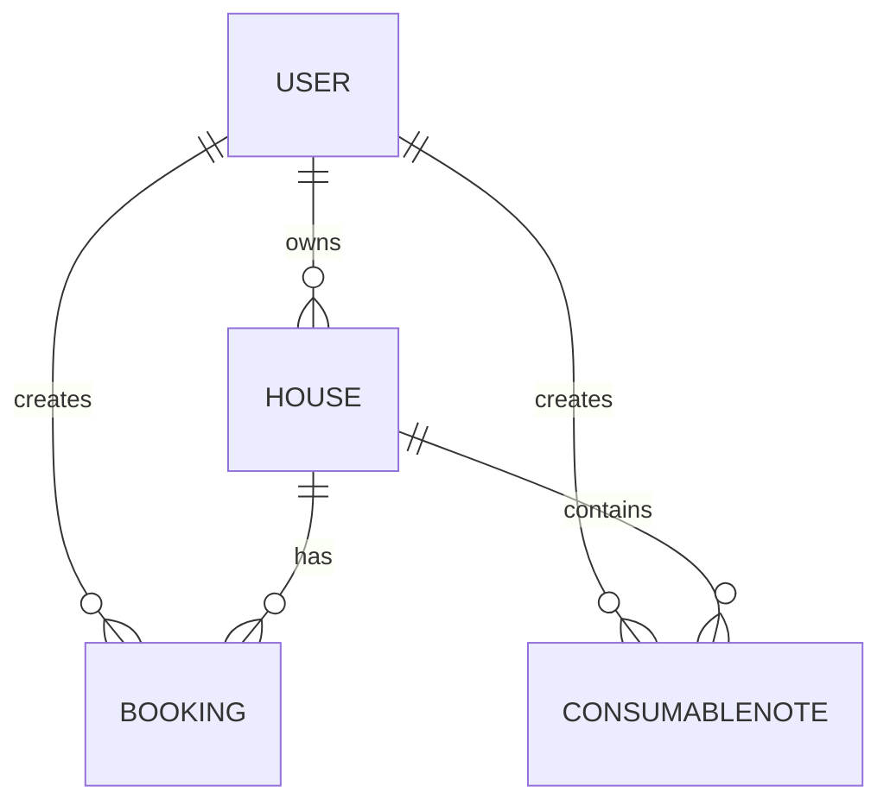

# План: Задача 02 - Проектирование схемы данных

## Цель

Актуализировать логическую и физическую модель данных, создать физическую ER-диаграмму и провести ревью схемы.

## Состав работ

### 1. Актуализация логической модели

На основе сценариев из Задачи 01:

**User:**
- id: Integer (PK)
- telegram_id: String (unique)
- name: String(100)
- role: Enum (tenant/owner/both)
- created_at: DateTime

**House:**
- id: Integer (PK)
- name: String(100)
- description: String(1000)
- capacity: Integer
- owner_id: Integer (FK → users.id)
- is_active: Boolean
- created_at: DateTime

**Booking:**
- id: Integer (PK)
- house_id: Integer (FK → houses.id)
- tenant_id: Integer (FK → users.id)
- check_in: Date
- check_out: Date
- guests_planned: JSON
- guests_actual: JSON (nullable)
- total_amount: Integer (nullable)
- status: Enum (pending/confirmed/cancelled/completed)
- created_at: DateTime

**Tariff:**
- id: Integer (PK)
- name: String(100)
- amount: Integer
- created_at: DateTime

**ConsumableNote:**
- id: Integer (PK)
- house_id: Integer (FK → houses.id)
- created_by: Integer (FK → users.id)
- name: String(100)
- comment: String(1000)
- created_at: DateTime

### 2. Проектирование физической модели (PostgreSQL)

**Типы данных:**
- PK: `BIGINT GENERATED ALWAYS AS IDENTITY` (в соответствии с best practices)
- String: `TEXT` или `VARCHAR(n)`
- Integer: `INTEGER` или `BIGINT`
- Boolean: `BOOLEAN`
- DateTime: `TIMESTAMPTZ`
- Date: `DATE`
- JSON: `JSONB`
- Enum: `CREATE TYPE ... AS ENUM`

**Индексы:**
- PK: автоматически
- telegram_id: UNIQUE
- house_id в bookings: для фильтров
- tenant_id в bookings: для фильтров
- check_in/check_out: для диапазонных запросов
- status: для фильтров

**Constraints:**
- FK с ON DELETE/UPDATE
- CHECK для валидации (check_in < check_out)
- NOT NULL где требуется

### 3. Создание ER-диаграммы

### 4. Ревью через skill postgresql-table-design

Вызвать skill для проверки:
- Типов данных PostgreSQL
- Индексов
- Constraints
- JSONB полей

### 5. Актуализация docs/data-model.md

Добавить раздел "Физическая модель" с:
- Таблицами и полями
- Типами PostgreSQL
- Индексами
- ER-диаграммой

## Definition of Done

- [ ] Физическая модель содержит все поля с типами PostgreSQL
- [ ] Определены индексы для частых запросов
- [ ] ER-диаграмма отображает все сущности и связи
- [ ] Ревью схемы через skill `postgresql-table-design` выполнено, замечания учтены

## Проверка пользователем

- [ ] Открыть `docs/data-model.md` — проверить раздел физической модели
- [ ] Проверить ER-диаграмму на корректность связей
- [ ] Убедиться, что индексы покрывают сценарии из Задачи 01
