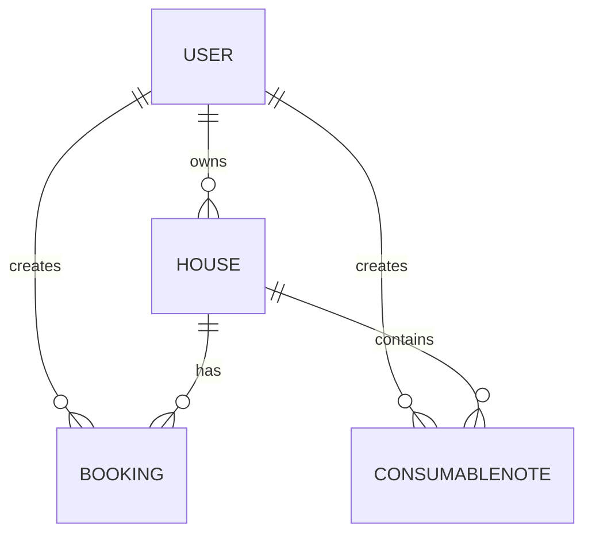

# Summary: Задача 02 - Проектирование схемы данных

## Что реализовано

### Физическая модель PostgreSQL

Создана физическая модель с типами данных PostgreSQL:

**Типы данных:**
- PK: `BIGINT GENERATED ALWAYS AS IDENTITY` (best practice)
- String: `VARCHAR(n)` / `TEXT`
- Integer: `INTEGER`
- Boolean: `BOOLEAN`
- DateTime: `TIMESTAMPTZ`
- Date: `DATE`
- JSON: `JSONB`
- Enum: `USER_ROLE`, `BOOKING_STATUS`

**Индексы:**
- users: PRIMARY KEY, UNIQUE на telegram_id
- houses: PRIMARY KEY, INDEX на owner_id, INDEX на is_active
- bookings: PRIMARY KEY, INDEX на house_id, INDEX на tenant_id, INDEX на status, INDEX на (check_in, check_out)
- tariffs: PRIMARY KEY
- consumable_notes: PRIMARY KEY, INDEX на house_id

**Constraints:**
- FK с ON DELETE/UPDATE
- CHECK для capacity > 0, amount >= 0, check_out > check_in
- NOT NULL для обязательных полей

### ER-диаграмма

### Обновления в docs/data-model.md

Добавлен раздел "Физическая модель (PostgreSQL)" с:
- Таблицами и полями
- Типами PostgreSQL
- Constraints
- Индексами
- ER-диаграммой
- Enums

## Definition of Done — статус

- [x] Физическая модель содержит все поля с типами PostgreSQL
- [x] Определены индексы для частых запросов
- [x] ER-диаграмма отображает все сущности и связи
- [ ] Ревью схемы через skill `postgresql-table-design` выполнено, замечания учтены (выполнится в Задаче 06)

## Примечание

Ревью схемы через skill `postgresql-table-design` будет выполнено в рамках Задачи 06 совместно с ревью других компонентов.
