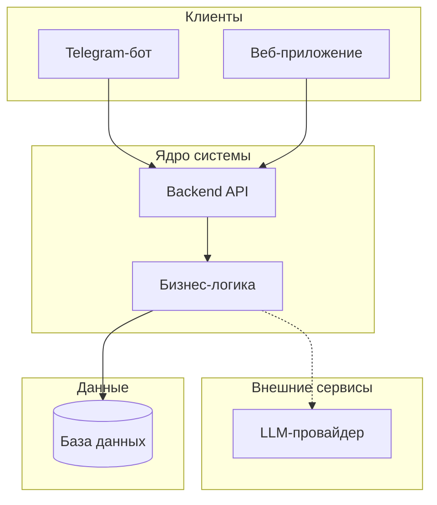

# Техническое видение проекта

## Границы системы

Система бронирования загородного жилья — это не Telegram-бот, а платформа с несколькими клиентами:

- **Telegram-бот** — первый клиент для быстрого старта
- **Веб-приложение** — единый frontend с разными ролями (арендатор, арендодатель)
- **Backend** — единое ядро системы, обслуживающее всех клиентов

Логика бронирования, работа с датами, тарифами, оплатой и оснащением домов централизована в backend.

---

## Архитектура системы



**Компоненты:**

| Компонент | Назначение |
|-----------|------------|
| Telegram-бот | Естественноязыковой интерфейс для бронирования через диалог |
| Веб-приложение | Полноценный интерфейс для арендаторов и арендодателей |
| Backend | Единое API, бизнес-логика, интеграции |
| База данных | Хранение бронирований, пользователей, домов, календарей |
| LLM | Обработка естественного языка в боте |

---

## Роли и сценарии

**Арендатор** — пользователь, бронирующий дом:
- Просмотр свободных и занятых дат
- Просмотр тарифов и условий
- Бронирование и отмена
- Просмотр своих бронирований
- Фиксация результатов поездки

**Арендодатель** — владелец домов:
- Управление календарём доступности
- Просмотр всех бронирований
- Управление тарифами
- Контроль остатков расходников в домах

---

## Доменные сущности

Ключевые понятия системы (детали в `data-model.md`):

- **Арендатор** — пользователь, создающий бронирования
- **Арендодатель** — владелец, управляющий домами
- **Дом** — объект бронирования с оснащением и тарифами
- **Бронирование** — запрос на проживание с датами и гостями
- **Календарь дома** — расписание доступности и занятости
- **Тариф** — гибкая ценовая политика, рассчитывается на каждого гостя индивидуально
- **Оплата** — финансовая транзакция по бронированию
- **Остаток расходников** — учёт расходных материалов в доме

### Модель тарификации

Тарифы комбинированные и персонализированные:

| Тип гостя | Тариф |
|-----------|-------|
| Ребёнок до 18 лет | Бесплатно |
| Взрослый (стандарт) | 250 ₽ |
| Постоянный гость | 150 ₽ |

При бронировании указывается состав группы по типам гостей. После окончания проживания фиксируется фактическое количество людей каждого типа — итоговая сумма пересчитывается.

---

## Структура репозитория

```
project/
├── bot/                   # Telegram-бот (клиент)
├── backend/               # Backend API (ядро системы)
├── web/                   # Веб-приложение (клиент)
├── docs/                  # Документация
│   ├── vision.md          # Этот документ
│   ├── idea.md            # Продуктовая идея
│   ├── data-model.md      # Модель данных
│   └── integrations.md    # Внешние интеграции
├── docker-compose.yaml    # Оркестрация компонентов
└── README.md              # Запуск проекта
```

---

## Принципы разработки

- **Backend-first** — бизнес-логика в ядре, клиенты только отображают
- **KISS** — минимум сложности на каждом этапе
- **Явное лучше неявного** — конфигурация через env
- **Инкрементальность** — MVP в боте, затем расширение до полной платформы

---

## Внешние связи

Детали интеграций в `integrations.md`:

- **LLM-провайдер** — обработка естественного языка
- **Платёжная система** — приём оплаты за бронирования
- **Telegram Bot API** — интеграция с мессенджером

---

## Архитектурные решения

Ключевые технические решения зафиксированы в ADR:

- [ADR-001: Выбор СУБД](adr/adr-001-database.md) — PostgreSQL как основная база данных

---

## Эволюция архитектуры

**MVP:** Telegram-бот с in-memory хранением

**Phase 2:**
- Выделение backend API
- Перенос логики из бота в backend
- База данных для постоянного хранения

**Phase 3:**
- Веб-приложение на базе backend API
- Личный кабинет арендатора
- Панель управления арендодателя
